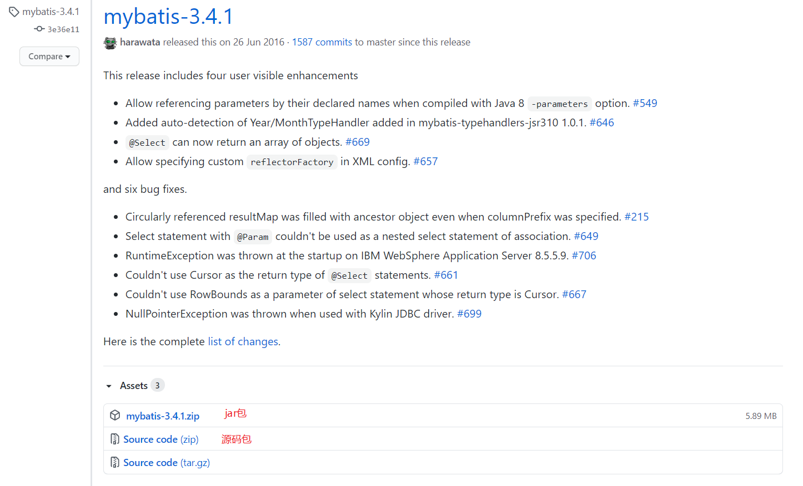
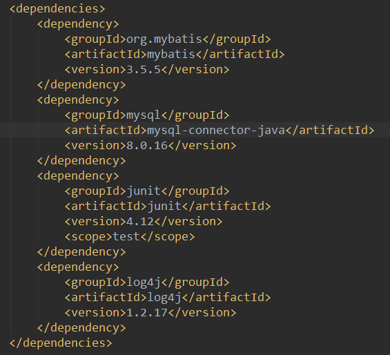
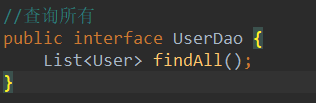
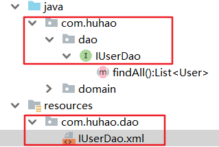
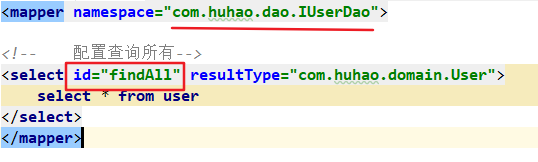
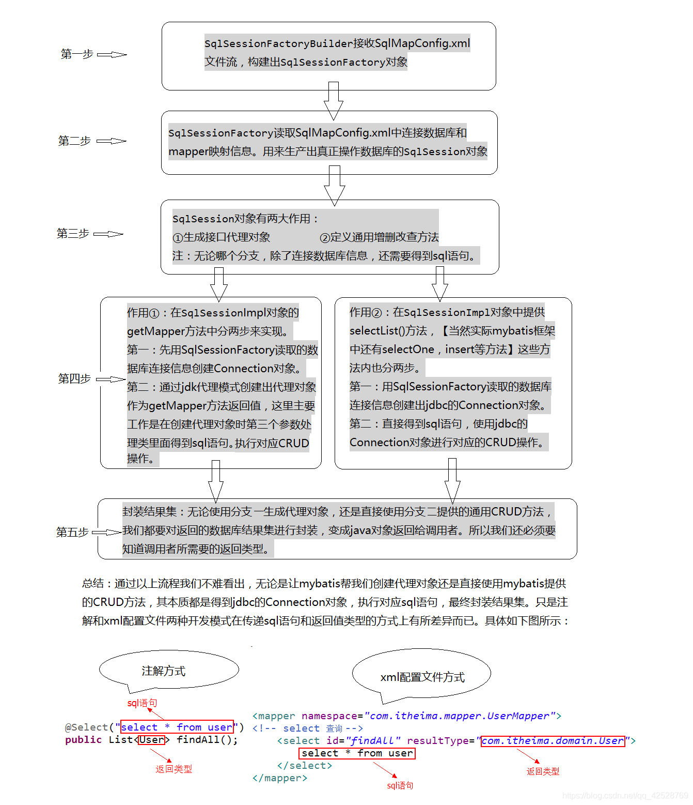
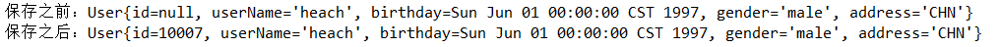
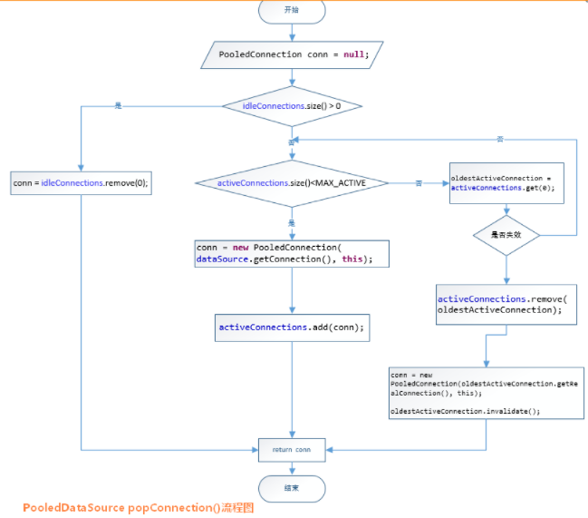
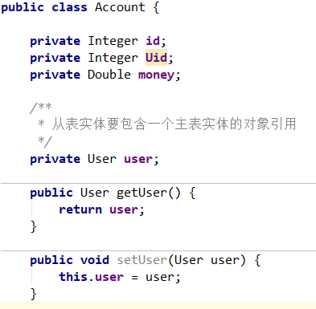
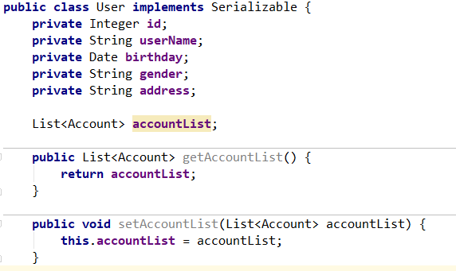

### 概述

持久层技术解决方案：

* JDBC 技术：
  * Connection
  * PreparedStatement
  * REsultSet
* Spring 的 JdbcTemplate
  * Spring 中对 JDBC 的简单封装
* Apache 的 DBUtils
  * 也是对 JDBC 的简单封装

以上这些都不是框架，JDBC 是规范，JdbcTemplate 和 DBUtils 是工具类。

MyBatis 是一个持久层框架，封装了 JDBC，开发者只需要编写 SQL 语句，而不需要关注 注册驱动、创建连接、创建 Statement 等复杂的过程。

MyBatis 使用了ORM 思想实现类结果集的封装。

ORM：Object Relational Mapping 对象映射关系

ORM 是一种把数据库表与实体类集实体类的属性对应起来的映射关系。

### 下载

[下载地址](https://github.com/mybatis/mybatis-3/releases?after=mybatis-3.4.3)



### 第一个 MyBatis 项目

#### 环境搭建


##### 创建 Maven 工程

创建普通 maven 工程

 导入相关依赖



##### 创建实体类

创建实体类，属性名称要和数据库表的字段一一对应。

实体类为什么要实现序列化接口？

Mybatis通过序列化得到对象的新实例，保证多线程安全（因为是从缓存中取数据，速度还是比从数据库获取要快）。具体说就是对象序列化后存储到缓存中，从缓存中取数据时是通过反序列化得到新的实例。

参考：[Mybatis为何要求持久层的javabean序列化？](https://blog.csdn.net/yzh_1346983557/article/details/84786246?utm_medium=distribute.pc_aggpage_search_result.none-task-blog-2~all~first_rank_v2~rank_v25-3-84786246.nonecase&utm_term=使用mybatis对象一定要序列化吗)

```java
public class User implements Serializable {

    private Integer id;
    private String userName;
    private Date birthday;
    private String gender;
    private String address;

    public Integer getId() {
        return id;
    }

    public void setId(Integer id) {
        this.id = id;
    }

    public String getUserName() {
        return userName;
    }

    public void setUserName(String userName) {
        this.userName = userName;
    }

    public Date getBirthday() {
        return birthday;
    }

    public void setBirthday(Date birthday) {
        this.birthday = birthday;
    }

    public String getGender() {
        return gender;
    }

    public void setGender(String gender) {
        this.gender = gender;
    }

    public String getAddress() {
        return address;
    }

    public void setAddress(String address) {
        this.address = address;
    }

    @Override
    public String toString() {
        return "User{" +
                "id=" + id +
                ", userName='" + userName + '\'' +
                ", birthday=" + birthday +
                ", gender='" + gender + '\'' +
                ", address='" + address + '\'' +
                '}';
    }
}
```

##### 查询操作 -- 相应的 Dao 类接口



##### 创建 MyBatis 的主配置文件

在resources目录下创建主配置文件 SqlMapConfig.xml

```xml
<?xml version="1.0" encoding="UTF-8"?>
<!DOCTYPE configuration
        PUBLIC "-//mybatis.org//DTD Config 3.0//EN"
        "http://mybatis.org/dtd/mybatis-3-config.dtd">

<!--MyBatis的主配置文件-->
<configuration>
    <!--配置环境-->
    <environments default="mysql">
        <!--配置mysql环境-->
        <environment id="mysql">
            <!--配置事务类型-->
            <transactionManager type="JDBC"></transactionManager>
            <!--配置数据源-->
            <dataSource type="POOLED">
                <!--配置数据源的基本参数-->
                <property name="driver" value="com.mysql.jdbc.Driver"></property>
                <property name="url" value="jdbc:mysql://localhost:3306/mybatis"></property>
                <property name="username" value="root"></property>
                <property name="password" value="hh123456"></property>
            </dataSource>
        </environment>
    </environments>

    <!--指定映射配置文件的位置，映射配置文件指定的是每个dao独立的配置文件-->
    <mappers>
        <mapper resource="com/huhao/dao/IUserDao.xml"></mapper>
    </mappers>
</configuration>
```

##### 创建映射配置文件

在 resources/com/huhao/dao 目录下创建映射配置文件 IUSerDao.xml

```xml
<?xml version="1.0" encoding="UTF-8"?>
        <!DOCTYPE mapper
                PUBLIC "-//mybatis.org//DTD Mapper 3.0//EN"
                "http://mybatis.org/dtd/mybatis-3-mapper.dtd">
<mapper namespace="com.huhao.dao.IUserDao">

<!--    配置查询所有：resultType表示的是SQL语句执行后返回的数据类型-->
<select id="findAll" resultType="com.huhao.domain.User">
    select * from users;
</select>
</mapper>
```

##### 环境搭建注意事项

1. 在 mybatis 中，把持久层的操作接口名称和映射文件也叫：`Mapper`
   所以如果看到 `IUserMapper.java` 其实跟 `IUserDao.java` 是一样的
2. mybatis 的映射配置文件位置必须和 dao 接口的包结构相同



3. 映射配置文件的mapper标签namespace属性的取值必须是dao接口的全限定类名

4. 映射配置文件的操作配置（select xxx），id 属性的取值必须是 dao 接口的方法名



3，4，5 点实现后，在开发中就不需要写 dao 接口的实现类了

#### 入门案例 -- 基于 xml

```java
@Test
public void findAllTest() throws Exception {
    // 1. 读取配置文件
    InputStream resourceAsStream = Resources.getResourceAsStream("SqlMapConfig.xml");
    // 2. 创建SqlSessionFactory工厂
    SqlSessionFactoryBuilder builder = new SqlSessionFactoryBuilder();
    SqlSessionFactory sqlSessionFactory = builder.build(resourceAsStream);
    // 3. 使用工厂生成sqlSession对象
    SqlSession sqlSession = sqlSessionFactory.openSession();
    // 4. 使用 SqlSession 创建Dao 接口的代理对象（动态代理，增强方法功能，使得接口的空方法可以实现需求）
    IUserDao userDao = sqlSession.getMapper(IUserDao.class);
    // 5. 使用代理对象执行方法
    List<User> users = userDao.findAll();
    for (User user : users) {
        System.out.println(user);
    }
    // 6. 释放资源
    sqlSession.close();
    resourceAsStream.close();
}
```

#### 入门案例 -- 基于注解

此时就不需要 IUserDao.xml 配置文件，可删除。

给Dao接口的方法加上注解

```java
public interface IUserDao {

    /**
     * 查询所有数据
     * @return
     */
    @Select("SELECT * FROM users;")
    List<User> findAll();
}
```

修改主配置文件

```xml
<!--使用注解配置的话，应使用 class属性来指定被注解的dao接口类的全限定类名-->
<mappers>
    <mapper class="com.huhao.dao.IUserDao"></mapper>
</mappers>
```

#### MyBatis 执行流程



### CRUD

#### 查询所有功能

和前面一样

#### 增加用户功能

IUserDao.java

```java
/**
 * 插入用户
 * @param user
 * @return
 */
void insertUser(User user);
```

IUserDao.xml

```xml
<!--保存用户-->
<insert id="insertUser" parameterType="com.huhao.domain.User">
    INSERT INTO users(userName, birthday, gender, address) VALUES (#{userName}, #{birthday}, #{gender},
    #{address});
</insert>
```

Test方法

```java
public class CRUDTest {

    private InputStream resourceAsStream;
    private SqlSessionFactory factory;
    private SqlSession sqlSession;
    private IUserDao userDao;

    @Before  // 测试方法之前执行
    public void init() throws Exception {
        // 1. 读取配置文件
        resourceAsStream = Resources.getResourceAsStream("SqlMapConfig.xml");
        // 2. 创建SqlSessionFactory工厂
        factory = new SqlSessionFactoryBuilder().build(resourceAsStream);
        // 3. 使用工厂创建SqlSession对象
        sqlSession = factory.openSession();
        // 4. 创建Dao 接口的代理对象
        userDao = sqlSession.getMapper(IUserDao.class);

    }

    @After  // 测试方法之后执行
    public void destroy() throws Exception {
        // 手动提交事务
        sqlSession.commit();
        // 6. 释放资源
        sqlSession.close();
        resourceAsStream.close();
    }

    @Test
    public void findAll() throws Exception {

        // 5. 使用代理对象实现方法
        List<User> users = userDao.findAll();
        for (User user : users) {
            System.out.println(user);
        }

    }

    @Test
    public void insertUser() throws Exception {
        User user = new User();
        user.setUserName("heach");
        SimpleDateFormat simpleDateFormat = new SimpleDateFormat("yyyy-MM-dd");
        Date date = simpleDateFormat.parse("1997-06-01");
        user.setBirthday(date);
        user.setGender("male");
        user.setAddress("CHN");

        userDao.insertUser(user);
    }
}
```

#### 修改和删除操作

IUserDao.java

```java
/**
 * 更新用户
 * @param user
 */
void updateUser(User user);
/**
 * 删除用户
 * @param id
 */
void deleteUser(Integer id);
```

IUserDao.xml

```xml
<!--更新用户-->
<update id="updateUser" parameterType="com.huhao.domain.User">
    UPDATE users SET userName=#{userName}, birthday=#{birthday}, gender=#{gender}, address=#{address} WHERE
    id=#{id};
</update>

<!--删除用户-->
<delete id="deleteUser" parameterType="java.lang.Integer">
    DELETE FROM users WHERE id=#{id};
</delete>
```

test方法

```java
@Test
public void updateUserTest() throws Exception {
    User user = new User();
    user.setId(10001);
    user.setUserName("joey");
    SimpleDateFormat simpleDateFormat = new SimpleDateFormat("yyyy-MM-dd");
    Date date = simpleDateFormat.parse("1986-06-26");
    user.setBirthday(date);
    user.setGender("male");
    user.setAddress("SA");

    userDao.updateUser(user);
}

@Test
public void deleteUserTest() throws Exception {
    int id = 10005;

    userDao.deleteUser(id);
}
```

#### 查询单条记录和模糊查询

IUserDao.java

```java
/**
 * 查询单条记录
 * @param id
 * @return
 */
User selectById(Integer id);

/**
 * 模糊查询
 * @param userName
 * @return
 */
List<User> selectByName(String userName);
```

IUserDao.xml

```xml
<!--查询单条记录-->
<select id="selectById" resultType="com.huhao.domain.User" parameterType="java.lang.Integer">
    SELECT * FROM users WHERE id=#{id};
</select>

<!--模糊查询-->
<select id="selectByName" resultType="com.huhao.domain.User" parameterType="java.lang.String">
    SELECT * FROM users WHERE userName LIKE #{userName};
</select>
```

test方法

```java
@Test
public void selectByIdTest() throws Exception {
    int id = 10001;
    User user = userDao.selectById(id);
    System.out.println(user);
}

@Test
public void selectByNameTest() throws Exception {
    String userName = "B%";
    List<User> users = userDao.selectByName(userName);
    for (User user : users) {
        System.out.println(user);
    }
}
```

#### 获取保存数据的id

在**增加用户**语句后面加上一条`select last_insert_id();`即可返回最近插入数据的主键

```java
<!--保存用户-->
    <insert id="insertUser" parameterType="com.huhao.domain.User">
    <!-- keyProperty: 实体类属性名称，keyColumn: 数据库列名，order:执行顺序，是之前是之前执行还是之后执行 -->
        <selectKey keyProperty="id" keyColumn="id" resultType="java.lang.Integer" order="AFTER">
        SELECT last_insert_id();
</selectKey>
    INSERT INTO users(userName, birthday, gender, address) VALUES (#{userName}, #{birthday}, #{gender},
                                                                   #{address});
</insert>
```

test 方法

```java
@Test
public void insertGetIdTest() throws Exception {
    User user = new User();
    user.setUserName("heach");
    SimpleDateFormat simpleDateFormat = new SimpleDateFormat("yyyy-MM-dd");
    Date date = simpleDateFormat.parse("1997-06-01");
    user.setBirthday(date);
    user.setGender("male");
    user.setAddress("CHN");
    System.out.println("保存之前：" + user);
    userDao.insertUser(user);
    System.out.println("保存之后：" + user);
}
```



#### MyBatis 中 @Param 注解的四种使用场景

以下几个场景需要用到 @Param 注解：

* 一、方法有多个参数（最常见）

```java
public interface UserMapper {
    Integer insert(@Param("username") String username, @Param("address") String address);
}
```

​		对应的 XML 中：

```xml
<insert id="insert" parameterType="org.javaboy.helloboot.bean.User">
    insert into user (username,address) values (#{username},#{address});
</insert>
```

* 二、方法参数需要取别名（费事，需求不多）

```java
public interface UserMapper {
    User getUserByUsername(@Param("name") String username);
}
```

对应的 XML 中：

```xml
<select id="getUserByUsername" parameterType="org.javaboy.helloboot.bean.User">
    select * from user where username=#{name};
</select>
```

* 三、XML 中的 SQL 使用了 $，$ 会有注入漏洞的问题，但是有的时候你不得不使用 $ 符号，例如要传入列名或者表名的时候，这个时候必须要添加 @Param 注解

```java
public interface UserMapper {
    List<User> getAllUsers(@Param("order_by")String order_by);
}
```

对应的 XML 中：

```xml
<select id="getAllUsers" resultType="org.javaboy.helloboot.bean.User">
    select * from user
    <if test="order_by!=null and order_by!=''">
        order by ${order_by} desc
    </if>
</select>
```

* 四、动态 SQL，如果动态 SQL 使用了参数作为变量，需要在接口对象中使用 @Param 注解

```java
public interface UserMapper {
    List<User> getUserById(@Param("id")Integer id);
}
```

对应的 XML 中：

```xml
<select id="getUserById" resultType="org.javaboy.helloboot.bean.User">
    select * from user
    <if test="id!=null">
        where id=#{id}
    </if>
</select>
```

### 连接池及事务

连接池就是用于存储连接的一个集合，该集合必须是线程安全的，不能两个线程拿到同一连接，该集合还必须实现队列的特性：先进先出。

#### MyBatis 中的连接池

MyBatis 连接池提供了3种方式的配置：

配置的位置：主配置文件`SqlMapConfig.xml`中的dataSource标签，**type属性**就是表示采用何种连接池方式

type 属性取值：

* **POOLED**：采用传统的 javax.sql.DataSource 规范中的连接池，mybatis 中有针对规范的实现
* **UNPOOLED**：采用传统的获取连接的方式，虽然也实现了 java.x.sql.DataSource 接口，但是并没有使用池的思想；每次使用都重新获取一个连接
* JNDI：采用服务器提供的JNDI技术实现，来获取DataSource对象，不同的服务器所能拿到的DataSource时不一样的

UNPOOLED 连接池：每次调用连接时都会创建一个连接，当并发量比较大时，就不合适了。

POOLED 连接池：具体步骤看代码；

```java
private PooledConnection popConnection(String username, String password) throws SQLException {
    boolean countedWait = false;
    PooledConnection conn = null;
    long t = System.currentTimeMillis();
    int localBadConnectionCount = 0;

    while (conn == null) {
      synchronized (state) {//用State做同步，空闲的链接集合和活跃的链接集合都在state中
        if (!state.idleConnections.isEmpty()) {//先查看当前的空闲连接池是否为空
          // Pool has available connection
          conn = state.idleConnections.remove(0);//不为空我就从空闲的连接池取咯
          if (log.isDebugEnabled()) {
            log.debug("Checked out connection " + conn.getRealHashCode() + " from pool.");
          }
        } else {
          // Pool does not have available connection
          if (state.activeConnections.size() < poolMaximumActiveConnections) {//现在没有空闲链接了，那看一下活跃队列，如果当前的链接结合还没满。
            // Can create new connection
            conn = new PooledConnection(dataSource.getConnection(), this);//创建链接！
            if (log.isDebugEnabled()) {
              log.debug("Created connection " + conn.getRealHashCode() + ".");
            }
          } else {//如果活跃连接满了，链接都很活跃，那证明并发很高了
            // Cannot create new connection
            PooledConnection oldestActiveConnection = state.activeConnections.get(0);
            long longestCheckoutTime = oldestActiveConnection.getCheckoutTime();
            if (longestCheckoutTime > poolMaximumCheckoutTime) {//既然现在满了，那就检查一下看看能不能有可以抢占的链接，先看一下这个连接被用了多久了，有米有超过我的限制。
              // Can claim overdue connection                //如果超限了，那么我此时应该把它抢占
              state.claimedOverdueConnectionCount++;
              state.accumulatedCheckoutTimeOfOverdueConnections += longestCheckoutTime;
              state.accumulatedCheckoutTime += longestCheckoutTime;
              state.activeConnections.remove(oldestActiveConnection);//移除这个连接
              if (!oldestActiveConnection.getRealConnection().getAutoCommit()) {
                try {
                  oldestActiveConnection.getRealConnection().rollback();
                } catch (SQLException e) {
                  log.debug("Bad connection. Could not roll back");
                }  
              }
              conn = new PooledConnection(oldestActiveConnection.getRealConnection(), this);//用原来老的Connection创建一个新的PooledConnection
              conn.setCreatedTimestamp(oldestActiveConnection.getCreatedTimestamp());
              conn.setLastUsedTimestamp(oldestActiveConnection.getLastUsedTimestamp());
              oldestActiveConnection.invalidate();
              if (log.isDebugEnabled()) {
                log.debug("Claimed overdue connection " + conn.getRealHashCode() + ".");
              }
            } else { //如果此时我没有可以抢占的连接池，那我怎么办？显然不能反回，那我还是在这等一会儿吧。wait一会儿
              // Must wait
              try {
                if (!countedWait) {
                  state.hadToWaitCount++;
                  countedWait = true;
                }
                if (log.isDebugEnabled()) {
                  log.debug("Waiting as long as " + poolTimeToWait + " milliseconds for connection.");
                }
                long wt = System.currentTimeMillis();
                state.wait(poolTimeToWait); //wait唤醒之后继续while 重复上述步骤。
                state.accumulatedWaitTime += System.currentTimeMillis() - wt;
              } catch (InterruptedException e) {
                break;
              }
            }
          }
        }
        if (conn != null) { //如果我现在拿到了链接，不管是从哪拿的吧
          if (conn.isValid()) {//先判断一下我的链接是否还有效，有效的话我就初始化一下。那么此时默认下一次循环会退出while
            if (!conn.getRealConnection().getAutoCommit()) {
              conn.getRealConnection().rollback();
            }
            conn.setConnectionTypeCode(assembleConnectionTypeCode(dataSource.getUrl(), username, password));
            conn.setCheckoutTimestamp(System.currentTimeMillis());
            conn.setLastUsedTimestamp(System.currentTimeMillis());
            state.activeConnections.add(conn);
            state.requestCount++;
            state.accumulatedRequestTime += System.currentTimeMillis() - t;
          } else {
            if (log.isDebugEnabled()) {
              log.debug("A bad connection (" + conn.getRealHashCode() + ") was returned from the pool, getting another connection.");
            }
            state.badConnectionCount++;
            localBadConnectionCount++;
            conn = null;
            if (localBadConnectionCount > (poolMaximumIdleConnections + 3)) {
              if (log.isDebugEnabled()) {
                log.debug("PooledDataSource: Could not get a good connection to the database.");
              }
              throw new SQLException("PooledDataSource: Could not get a good connection to the database.");
            }
          }
        }
      }

    }

    if (conn == null) {
      if (log.isDebugEnabled()) {
        log.debug("PooledDataSource: Unknown severe error condition.  The connection pool returned a null connection.");
      }
      throw new SQLException("PooledDataSource: Unknown severe error condition.  The connection pool returned a null connection.");
    }

    return conn;
  }
```

当线程需要调用一个数据库连接时：

1. 先看是否有空闲（idle）状态下的 PooledConnection 对象，如果有，就直接返回一个可用的 PooledConnection 对象；否则进行第2步。
2. 查看活动状态的 PooledConnection 池 activeConnections 是否已满；如果没有满，则创建一个新的 PooledConnection 对象，然后放到 activeConnections 池中，然后返回此 PooledConnection 对象；否则进行第三步；
3. 看最先进入 activeConnections 池中的 PooledConnection 对象是否已经过期：如果已经过期，从 activeConnections 池中移除此对象，然后创建一个新的 PooledConnection 对象，添加到 activeConnections 中，然后将此对象返回；否则进行第4步。
4. 线程等待，循环2步



参考：[Mybatis数据库连接池解析](https://www.jianshu.com/p/21cf094cb97b)

​			[Mybatis深入之数据库连接池原理](https://blog.csdn.net/crave_shy/article/details/46611205)

#### MyBatis 中的事务

MyBatis 是通过 SqlSession 对象的 commit() 方法和 rollback() 方法来实现事务的提交和回滚的。

### MyBatis 里的多表操作

表之间的关系：

* 一对一 ：人和身份证
* 一对多：用户和订单
* 多对多：学生和课程

#### 建立实体类关系的方式查询

需求：查询所有账户，并且带有用户名称和地址信息

**从表实体要包含一个主表实体的对象引用**



IAccountDao.xml

```xml
<!--定义封装account和user的resultMap-->
<resultMap id="accountUserMap" type="com.huhao.domain.Account">
    <id property="id" column="id"></id>
    <result property="Uid" column="Uid"></result>
    <result property="money" column="money"></result>

    <!--一对一的关系映射，配置封装user的内容-->
    <association property="user" column="Uid" javaType="com.huhao.domain.User">
        <id property="id" column="id"></id>
        <result property="userName" column="userName"></result>
        <result property="birthday" column="birthday"></result>
        <result property="gender" column="gender"></result>
        <result property="address" column="address"></result>
    </association>
</resultMap>

<!--查询所有账户方法-->
<select id="findAll" resultType="com.huhao.domain.Account">
    SELECT * FROM accounts;
</select>

<select id="findAllAccounts" resultMap="accountUserMap">
    SELECT users.*, accounts.id, accounts.Uid, accounts.money FROM accounts, users WHERE users.id=accounts.Uid;
</select>
```

#### 一对多查询

查询所有用户，同时获取到用户下的所有账户的信息

**一对多关系映射，主表实体类应该包含从表实体类的集合引用**



IUserDao.xml

```xml
<?xml version="1.0" encoding="UTF-8"?>
<!DOCTYPE mapper
        PUBLIC "-//mybatis.org//DTD Mapper 3.0//EN"
        "http://mybatis.org/dtd/mybatis-3-mapper.dtd">
<mapper namespace="com.huhao.dao.IUserDao">

    <!--查询所有用户方法-->
    <select id="findAll" resultType="com.huhao.domain.User">
        SELECT * FROM users;
    </select>

    <resultMap id="userAccountMap" type="com.huhao.domain.User">
        <id property="id" column="id"></id>
        <result property="userName" column="userName"></result>
        <result property="birthday" column="birthday"></result>
        <result property="gender" column="gender"></result>
        <result property="address" column="address"></result>

        <collection property="accountList" ofType="com.huhao.domain.Account">
            <id property="id" column="id"></id>
            <result property="Uid" column="Uid"></result>
            <result property="money" column="money"></result>
        </collection>
    </resultMap>


    <select id="findAllUsers" resultMap="userAccountMap">
        SELECT users.*, accounts.id, accounts.Uid, accounts.money FROM users
        LEFT OUTER JOIN accounts ON users.id= accounts.Uid;
    </select>

</mapper>
```

#### 多对多查询

参考：https://blog.csdn.net/qq_42528769/article/details/105210620

### MyBatis 的延迟加载策略

延迟加载：在真正使用数据时才发起查询，不用的时候不查询，也叫**按需加载**（懒加载）

立即加载：不管用不用，只要一调用方法，**马上发起查询**

一对**多**，多对**多**：通常情况下，我们采用**延迟加载**

多对**一**，一对**一**：通常情况下，我们采用**立即加载**

### MyBatis 中的缓存

缓存：存在内存中的临时数据

减少和数据库的交互次数，提高执行效率

适用于缓存：经常查询，并且**不经常改变**的；数据的正确与否对最终结果**影响不大**的

不适用于缓存：**经常改变**的数据；数据的正确与否对最终结果**影响很大**的

##### 一级缓存

MyBatis中**SqlSession**对象的缓存；

当我们执行查询之后，查询的结果会同时存入SqlSession为我们提供的一块区域中，该区域的结构是一个**Map**，当我们再次查询同样的数据，MyBatis会先去SqlSession中查询是否有，有的话直接拿出来用，当SqlSession对象消失时，MyBatis的一级缓存也就消失了。

如果数据库中的数据跟缓存中的数据不一致了，要如何做到**同步**呢？

MyBatis 检测到调用SqlSession的**修改**，**添加**，**删除**，`commit()`，`close()`等方法时，会清空缓存，该从数据库中获取数据。

**总结**：

一级缓存是SqlSession范围的缓存，当调用SqlSession的**修改**，**添加**，**删除**，`commit()`，`close()`等方法时，就会**清空一级缓存**

##### 二级缓存

MyBatis中**SqlSessionFactory对象**的缓存，由同一个SqlSessionFactory对象创建的**SqlSession**共享其缓存


参考：[聊聊MyBatis缓存机制](https://tech.meituan.com/2018/01/19/mybatis-cache.html)

### MyBatis注解开发

