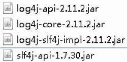

### Spring5 框架新功能

#### spring5 框架的代码基于 java8，运行时兼容JDK9，许多不建议使用的类和方法在代码库中删除

#### Spring 5.0框架自带了通用的日志封装

Spring5已经移除 Log4jConfigListener，官方建议使用Log4j2，Spring5框架整合Log4j2。

##### 1. 引入 jar 包



##### 2. 创建log4j2.xml配置文件

```xml
<?xml version="1.0" encoding="UTF-8"?>
<!--日志级别以及优先级排序: OFF > FATAL > ERROR > WARN > INFO > DEBUG > TRACE > ALL --> 
<!--Configuration后面的status用于设置log4j2自身内部的信息输出，可以不设置，当设置成trace时，可以看到log4j2内部各种详细输出--> 
<configuration status="INFO"> 
    <!--先定义所有的appender--> 
    <appenders> 
        <!--输出日志信息到控制台--> 
        <console name="Console" target="SYSTEM_OUT"> 
            <!--控制日志输出的格式--> 
            <PatternLayout pattern="%d{yyyy-MM-dd HH:mm:ss.SSS} [%t] %-5level %logger{36} - %msg%n"/> 
        </console> 
    </appenders> 
    <!--然后定义logger，只有定义logger并引入的appender，appender才会生效--> <!--root：用于指定项目的根日志，如果没有单独指定Logger，则会使用root作为默认的日志输出--> 
    <loggers> 
        <root level="info"> <appender-ref ref="Console"/> 
        </root>

    </loggers> 
</configuration>
```

#### Spring5框架核心容器支持@Nullable注解

@Nullable注解可以使用在方法上面，属性上面，参数上面，表示方法返回可以为空，属性值可以为空，参数值可以为空

#### Spring5核心容器支持函数式风格GenericApplicationContext

#### Spring5支持整合JUnit5

#### Webflux（后期再看）

前期掌握：SpringMVC、SpringBoot、Maven 和 Java8 新特性

