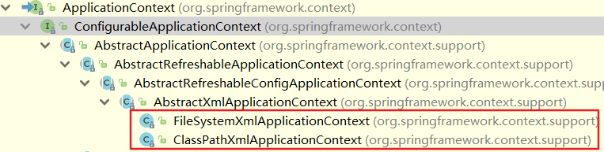

### Spring 框架概论

spring 框架是轻量级的开源的JavaEE框架

Spring可以解决企业应用开发的复杂性

Spring 框架结构


Spring两个核心部分：IOC和AoP

* IOC：控制反转，把创建对象过程交给Spring进行管理
* Aop：面向切面，不修改源代码进行功能增强

Spring 特点：

Spring版本：5.2.6

下载地址： https://repo.spring.io/release/org/springframework/spring/5.2.6.RELEASE/ 


### 入门案例

1. IDEA 创建普通Java工程

   

2. 导入 Spring5 相关jar包

   

   

[idea添加jar和移除jar包的三种方式](https://blog.csdn.net/qq_39707130/article/details/81431136 )

3. 创建普通类，在该类中创建普通方法
4. 创建 Spring 配置文件，在配置文件中配置创建的对象
   
   * 4.1 Spring配置文件使用xml格式
   
     

5. 测试代码编写

   ```java
   public class TestSpring5 {
   
       @Test
       public void testAdd() {
   
           // 1. 加载spring配置文件
           ApplicationContext context = new ClassPathXmlApplicationContext("bean1.xml");
   
           // 2. 获取配置文件创建的对象
           User user = context.getBean("user", User.class);
   
           System.out.println(user);
           user.add();
       }
   }
   ```

   输出结果：

   ```markdown
   com.joeyhu.spring5.User@27808f31
   adding ...
   ```

### IOC 容器

控制反转（IOC），把对象创建和对象之间的调用过程，交给Spring进行管理。IOC的目的是降低耦合度。

入门案例就是IOC的实现。

#### IOC 底层原理

xml 解析，工厂模式，反射

[IoC/DI基本思想的演变](https://www.cnblogs.com/xinhuaxuan/p/6128523.html)


原始方式：UserService 直接实例化类 UserDao，两个类之间的耦合度较高

工厂模式：UserService 通过 User 工厂调用 UserService，降低了耦合度


IOC过程：先通过配置文件配置创建的对象，UserService 依然通过工厂类实例化 UserDao 对象，但是此时的工厂类是通过解析 xml，在通过反射机制创建对象，而不是直接实例化对象。这样进一步降低了耦合度。

#### IOC接口（BeanFactory）

IOC 思想基于 IOC 容器完成，IOC 容器的底层就是对象工厂。


Spring 提供 IOC 容器实现两种方式：（两个接口）

1. BeanFactory：IOC容器基本实现，是Spring内部的使用接口，不提供开发人员进行使用

   **加载配置文件时候不会创建对象，在获取对象（使用）才去创建对象**

2. ApplicationContext：**BeanFactory接口的子接口**，提供更多更强大的功能，一般由开发人员进行使用

   **加载配置文件时候就会把在配置文件对象进行创建**

BeanFactory与ApplicationContext的区别是什么？

BeanFactory 采用了工厂设计模式，负责**读取 bean 配置文档，管理 bean 的加载，实例化，维护 bean 之间的依赖关系，负责 bean 的声明周期**。而 ApplicationContext **除了提供上述 BeanFactory 所能提供的功能之外，还提供了更完整的框架功能：国际化支持、aop、事务**等。同时 BeanFactory 在解析配置文件时并不会初始化对象,只有在使用对象 **getBean()** 才会对该对象进行初始化，而ApplicationContext 在解析配置文件时对配置文件中的所有对象都初始化了，**getBean() **方法只是获取对象的过程。

因此我们一般在使用的时候尽量使用**ApplicationContext**。


**ApplicationContext实现类：**



FileSystemXmlApplicationContext 和 ClassPathXmlApplicationContext 是 ApplicationContext 接口的两个主要的实现类。

两者区别：

* FileSystemXmlApplicationContext：该方法是从文件绝对路径加载配置文件；

* ClassPathXmlApplicationContext：该方法是从类路径中加载配置文件，默认路径是src下那一级。


Bean 管理指的是两个操作：Spring 创建对象和 Spring 注入属性

#### IOC 操作 Bean 管理（基于 xml ）

##### 基于 xml 方式创建对象

```xml
<!--配置User对象创建-->
<bean id="user" class="com.joeyhu.spring5.User"></bean>
```

在 bean.xml 配置文件中，使用 bean 标签，标签里面添加对应属性，就可以实现对象创建。

Bean 标签常用属性

> id：bean的唯一标识，不能重复，否则报错
>
> class：全限定类名，指向classpath下类定义所在位置

后期整理：[bean标签的常用属性](https://blog.csdn.net/lzgsea/article/details/79795290)


基于 xml 方式创建对象时，默认是**执行无参构造方法来创建对象**（所以在实体类里添加有参构造方法时，注意将无参构造方法也写出来）。

##### 基于xml方式注入属性

DI（Dependency Injection）：依赖注入，就是注入属性

> IOC 和 DI 有什么区别？
>
> IOC 是一种思想，DI 是 IOC 一种具体实现，是同一个概念的不同角度描述。
>
> 由于控制反转概念比较含糊（可能只是理解为容器控制对象这一个层面，很难让人想到谁来维护对象关系），所以2004年大师级人物Martin Fowler又给出了一个新的名字：“依赖注入”，相对IoC 而言，“依赖注入”明确描述了“被注入对象依赖IoC容器配置依赖对象”。

后期整理：https://www.iteye.com/blog/jinnianshilongnian-1413846


**第一种注入属性方式：set 方法**

* 1.创建类，定义属性和对应的set方法

```java
public class Book {

    private String bName;
    private String bAuthor;

    public void setbName(String bName) {
        this.bName = bName;
    }

    public void setbAuthor(String bAuthor) {
        this.bAuthor = bAuthor;
    }
}
```

* 2.在 spring 配置文件配置对象创建，配置属性注入

```xml
<!--演示set方法注入属性-->
<bean id="book" class="com.joeyhu.spring5.Book">
    <!--使用 property 完成属性注入
            name: 类属性名称
            value：向属性注入的值
        -->
    <property name="bName" value="人类的群星闪耀时"></property>
    <property name="bAuthor" value="史蒂芬茨威格"></property>
</bean>
```

**第二种注入属性方式：使用有参数构造函数进行注入**

* 1.创建类，定义属性，创建属性对应有参数构造方法

```java
public class Order {
    private String oName;
    private String address;

    public Order() { }

    public Order(String oName, String address) {
        this.oName = oName;
        this.address = address;
    }
}
```

* 2.在spring配置文件中进行配置

```xml
<!--有参构造属性注入-->
<bean id="order" class="com.joeyhu.spring5.Order">
    <constructor-arg name="oName" value="001"/>
    <constructor-arg name="address" value="兰州"/>
</bean>
```

**第三种注入方式：p 名称空间注入（仅做了解）**

* 1.在配置文件中 beans 节点添加p名称空间

```xml
<beans xmlns="http://www.springframework.org/schema/beans"
       xmlns:xsi="http://www.w3.org/2001/XMLSchema-instance"
       <!--p名称空间-->
       xmlns:p="http://www.springframework.org/schema/p"
       xsi:schemaLocation="http://www.springframework.org/schema/beans http://www.springframework.org/schema/beans/spring-beans.xsd">
```

* 2.在配置文件中通过p名称空间进行注入

```xml
<!--2 set方法注入属性-->
<bean id="book" class="com.joeyhu.spring5.Book" p:bName="人类的群星闪耀时" p:bAuthor="史蒂芬茨威格"></bean>
```


#### IOC 操作 Bean 管理（xml 注入其他类型属性）

##### 字面量

- **null值**

  ```xml
  <!--演示null值-->
  <property name="bPublisher">
      <null></null>
  </property>
  ```

- **属性值中包含特殊符号**

  ```xml
  <!--属性值包含特殊符号
          1 把<>进行转义 &lt; &gt;
          2 把带特殊符号内容写到CDATA
  -->
  <property name="bPublisher">
      <value><![CDATA[<<***出版社>>]]></value>
  </property>
  ```

##### 注入属性-外部 bean

1. 创建两个类 service类和dao类

2. 在service调用dao里面的方法

3. 在spring配置文件中进行配置

```java
public class UserDao implements IUserDao {
    @Override
    public void update() {
        System.out.println("UserDao update...........");
    }
}
```

```java
public class UserService implements IUserService{

    //创建UserDao类型属性，生成set方法
    private UserDao userDao;

    public void setUserDao(UserDao userDao) {
        this.userDao = userDao;
    }

    @Override
    public void add() {
        System.out.println("UserService add ...");
        userDao.update();
    }
}
```

```xml
<!--1 service和dao对象创建-->
<bean id="userService" class="com.joeyhu.spring5.service.impl.UserService">
    <!--注入userDao对象
            name属性：类里面属性名称
            ref属性：创建userDao对象bean标签id值
        -->
    <property name="userDao" ref="userDao"></property>
</bean>
<bean id="userDao" class="com.joeyhu.spring5.dao.impl.UserDao"></bean>
```

##### 注入属性-内部 bean

1. 一对多关系：部门和员工
   一个部门有多个员工，一个员工属于一个部门
2. 在实体类之间表示一对多关系，员工表示所属部门，使用对象类型属性进行表示
3. 在spring配置文件中进行配置

```java
public class Dept {

    private String dName;

    public void setdName(String dName) {
        this.dName = dName;
    }
}
```

```java
public class Employee {

    private String eName;
    private String eGender;
    private String dept;

    public void seteName(String eName) {
        this.eName = eName;
    }

    public void seteGender(String eGender) {
        this.eGender = eGender;
    }

    public void setDept(String dept) {
        this.dept = dept;
    }

    @Override
    public String toString() {
        return "Employee{" +
                "eName='" + eName + '\'' +
                ", eGender='" + eGender + '\'' +
                ", dept='" + dept + '\'' +
                '}';
    }
}

```

```xml
<!--内部bean-->
<bean id="employee" class="com.joeyhu.spring5.innerbean.Employee">
    <property name="eName" value="Adam"></property>
    <property name="eGender" value="male"></property>
    <!--设置对象类型属性-->
    <property name="dept">
        <bean id="dept" class="com.joeyhu.spring5.innerbean.Dept">
            <property name="dName" value="安保部"></property>
        </bean>
    </property>
</bean>
```

个人感觉外部 bean 的方法比内部 bean 方法要清晰。

##### 注入属性-级联赋值

```xml
<bean id="employee" class="com.joeyhu.spring5.innerbean.Employee">
        <property name="eName" value="Adam"></property>
        <property name="eGender" value="male"></property>
        <!--级联赋值-->
        <property name="dept" ref="dept"></property>
    </bean>

    <bean id="dept" class="com.joeyhu.spring5.innerbean.Dept">
        <property name="dName" value="财务部"></property>
    </bean>
```

#### IOC 操作 Bean 管理（xml 注入集合类型属性）

##### 注入数组类型属性

##### 注入 List 集合类型属性

##### 注入 Map 集合类型属性

1. 创建类，定义数组、list、map、set 类型属性，生成对应 set 方法

2. 在 spring 配置文件进行配置

```java
public class Student {

    /**
     * 1. 数组类型属性
     */
    private String[] courses;

    /**
     * 2. List 类型属性
     */
    private List<String> lists;

    /**
     * 3. map 类型属性
     */
    private Map<String, String> maps;

    /**
     * 4. set 类型属性
     */
    private Set<String> sets;

    public void setCourses(String[] courses) {
        this.courses = courses;
    }

    public void setLists(List<String> lists) {
        this.lists = lists;
    }

    public void setMaps(Map<String, String> maps) {
        this.maps = maps;
    }

    public void setSets(Set<String> sets) {
        this.sets = sets;
    }

    @Override
    public String toString() {
        return "Student{" +
                "courses=" + Arrays.toString(courses) +
                ", lists=" + lists +
                ", maps=" + maps +
                ", sets=" + sets +
                '}';
    }
}
```

```xml
<!--1 集合类型属性注入-->
<bean id="student" class="com.joeyhu.spring5.collectiontype.Student">
    <!--数组类型属性注入-->
    <property name="courses">
        <array>
            <value>数据结构</value>
            <value>操作系统</value>
        </array>
    </property>

    <!--List类型属性注入-->
    <property name="lists">
        <list>
            <value>拿破仑</value>
            <value>列宁</value>
        </list>
    </property>

    <!--Map类型属性注入-->
    <property name="maps">
        <map>
            <entry key="JAVA" value="java"></entry>
            <entry key="C LANGUAGE" value="c language"></entry>
        </map>
    </property>

    <!--set类型属性注入-->
    <property name="sets">
        <set>
            <value>setValue1</value>
            <value>setValue2</value>
        </set>
    </property>
</bean>
```

##### 在集合里面设置对象类型值

```java
public class Course {

    private String cname;

    public void setCname(String cname) {
        this.cname = cname;
    }

    @Override
    public String toString() {
        return "Course{" +
                "cname='" + cname + '\'' +
                '}';
    }
}
```

```java
public class Student {

    ... ...

    /**
     * 对象类型属性
     */
    private List<Course> courseList;

    public void setCourseList(List<Course> courseList) {
        this.courseList = courseList;
    }

   ... ...

    @Override
    public String toString() {
        return "Student{" +
                "courses=" + Arrays.toString(courses) +
                ", lists=" + lists +
                ", maps=" + maps +
                ", sets=" + sets +
                ", courseList=" + courseList +
                '}';
    }
}
```

```xml
<!--1 集合类型属性注入-->
<bean id="student" class="com.joeyhu.spring5.collectiontype.Student">
    ... ...

    <!--对象list属性注入-->
    <property name="courseList">
        <list>
            <ref bean="course1"></ref>
            <ref bean="course2"></ref>
        </list>
    </property>
</bean>

<!--创建多个course对象-->
<bean id="course1" class="com.joeyhu.spring5.collectiontype.Course">
    <property name="cname" value="Spring5框架"></property>
</bean>

<bean id="course2" class="com.joeyhu.spring5.collectiontype.Course">
    <property name="cname" value="MyBatis框架"></property>
</bean>
```

##### 把集合注入部分提取出来

在spring配置文件中引入名称空间 util

使用util标签完成list集合注入提取

... ... 后期补充

```xml
<?xml version="1.0" encoding="UTF-8"?> <beans xmlns="http://www.springframework.org/schema/beans" xmlns:xsi="http://www.w3.org/2001/XMLSchema-instance" xmlns:p="http://www.springframework.org/schema/p" xmlns:util="http://www.springframework.org/schema/util" xsi:schemaLocation="http://www.springframework.org/schema/beans http://www.springframework.org/schema/beans/spring-beans.xsd http://www.springframework.org/schema/util http://www.springframework.org/schema/util/spring-util.xsd">
```


注入属性可以给对象赋值，那如何更改对象属性呢？？？

后期整理：https://blog.csdn.net/u012702547/article/details/56307861

#### IOC 操作 Bean 管理（FactoryBean）

Spring有两种类型bean，一种普通bean，另外一种工厂bean（FactoryBean）

> 普通bean：在配置文件中定义bean类型就是返回类型
>
> 工厂bean：在配置文件定义bean类型可以和返回类型不一样，在 getObject() 方法中定义返回类

##### 如何实现 factoryBean

**1. 创建类，让这个类作为工厂bean，实现接口 FactoryBean**

**2. 实现接口里面的方法，在实现的方法中定义返回的bean类型**

```java
public class MyFactoryBean implements FactoryBean<Course>{

    /**
     * 定义 bean 返回类型
     * @return
     * @throws Exception
     */
    @Override
    public Course getObject() throws Exception {
        Course course = new Course();
        course.setCname("汉语言");
        return course;
    }

    @Override
    public Class<?> getObjectType() {
        return null;
    }

    @Override
    public boolean isSingleton() {
        return false;
    }
```

```xml
<bean id="myFactoryBean" class="com.joeyhu.spring5.factorybean.MyFactoryBean"></bean>
```

```java
// test方法
@Test
public void testFactoryBean() {

    // 1. 加载spring配置文件
    ApplicationContext context = new ClassPathXmlApplicationContext("bean2.xml");

    // 2. 获取配置创建的对象
    // 注意getBean里面的class和String不一样，注意返回类型
    Course myFactoryBean = context.getBean("myFactoryBean", Course.class);
    System.out.println(myFactoryBean);
}
```

#### IOC 操作 Bean 管理（Bean 作用域）

> 作用域种类：
>
> **singleton：单例模式，使用 singleton 定义的 Bean 在 Spring 容器中只有一个实例，这也是 Bean 默认的作用域。**
>
> **prototype：原型模式，每次通过 Spring 容器获取 prototype 定义的 Bean 时，容器都将创建一个新的 Bean 实例。**
>
> request：在一次 HTTP 请求中，容器会返回该 Bean 的同一个实例。而对不同的 HTTP 请求，会返回不同的实例，该作用域仅在当前 HTTP Request 内有效。
>
> session：在一次 HTTP Session 中，容器会返回该 Bean 的同一个实例。而对不同的 HTTP 请求，会返回不同的实例，该作用域仅在当前 HTTP Session 内有效。
>
> global seesion：在一个全局的 HTTP Session 中，容器会返回该 Bean 的同一个实例。该作用域仅在使用 portlet context 时有效。
>
> 在以上五种作用域中，singleton 和 prototype 是最常用的两种。
>
> singleton 和 prototype 区别？
>
> singleton 是单实例，prototype 是多实例
>
> 当 scope 值是 singleton 或者是默认情况时，加载spring配置文件时候就会创建单实例对象；当 scope 值是 prototype 时，不是在加载 spring 配置文件时候创建对象，在调用 getBean 方法时候创建多实例对象。

如何设置创建bean实例是单实例还是多实例？

```java
// 测试用例
@Test
public void testScope() {

    ApplicationContext context = new ClassPathXmlApplicationContext("bean3.xml");

    Book book1 = context.getBean("book", Book.class);
    Book book2 = context.getBean("book", Book.class);

    System.out.println(book1);
    System.out.println(book2);
}
```

```xml
<!--默认单例模式，什么都不加-->
<bean id="book" class="com.joeyhu.spring5.collectiontype.Book">
    <property name="bName" value="人类的群星闪耀时"></property>
</bean>
```

输出结果：

```markdown
// 两个对象地址相同 -- 单例
com.joeyhu.spring5.collectiontype.Book@e720b71
com.joeyhu.spring5.collectiontype.Book@e720b71
```

```xml
<!--多例模式 添加scope标签，值为prototype-->
<bean id="book" class="com.joeyhu.spring5.collectiontype.Book" scope="prototype">
    <property name="bName" value="人类的群星闪耀时"></property>
</bean>
```

输出结果：

```mark
// 两个对象地址不同 -- 多例
com.joeyhu.spring5.collectiontype.Book@ed9d034
com.joeyhu.spring5.collectiontype.Book@6121c9d6
```

#### IOC 操作 Bean 管理（Bean 生命周期）

##### 生命周期：从对象创建到销毁的过程。

> bean 的生命周期：
>
> * 1.通过构造器创建 bean 实例（无参构造）
> * 2.为 bean 注入属性和对其他 bean 引用（调用 set 方法）
> * 3.调用 bean 的初始化的方法（需要进行配置初始化的方法）
> * 4.获取到 bean 对象
> * 5.当容器关闭时，调用 bean 的销毁方法（需要进行配置销毁的方法）

##### Bean 生命周期演示

```java
public class Order {

    private String oName;

    public Order() {
        System.out.println("第一步：通过无参构造创建 bean 实例");
    }

    public void setoName(String oName) {
        this.oName = oName;
        System.out.println("第二步：为 bean 注入属性");
    }

    /**
     * bean 初始化方法
     */
    public void initMethod() {
        System.out.println("第三步：调用bean的初始化的方法");

    }

    /**
     * bean 销毁方法
     */
    public void destroyMethod() {
        System.out.println("第五步：调用bean的销毁方法");
    }
}
```

```xml
<bean id="order" class="com.joeyhu.spring5.beanlifecycle.Order" init-method="initMethod" destroy-method="destroyMethod">
    <property name="oName" value="cellphone"></property>
</bean>
```

```java
// 测试方法
@Test
public void testLifecycle() {

    ApplicationContext context = new ClassPathXmlApplicationContext("bean4.xml");

    Order order = context.getBean("order", Order.class);
    System.out.println("第四步：获取到bean");
    System.out.println(order);

    ((ClassPathXmlApplicationContext)context).close();
}
```

输出结果: 

```mark
第一步：通过无参构造创建 bean 实例
第二步：为 bean 注入属性
第三步：调用bean的初始化的方法
第四步：获取到bean
com.joeyhu.spring5.beanlifecycle.Order@491cc5c9
第五步：调用bean的销毁方法
```

##### Bean 的后置处理器（BeanPostProcessor）

* 调用顺序：在Bean的初始化前后调用，分别对应了其中的两个方法 postProcessBeforeInitialization 和 postProcessAfterInitialization。
* 使用场景：在Bean的初始化前后做一些自己的逻辑处理，比如为Bean设置一些额外的属性。
* BeanFactory 和 ApplicationContext 两个容器对待 bean 的后置处理器稍微有些不同。**ApplicationContext 容器会自动检测Spring 配置文件中那些 bean 所对应的 Java 类实现了 BeanPostProcessor 接口，并自动把它们注册为后置处理器。**在创建bean 过程中调用它们。

演示添加后置处理器效果

* 创建类，实现接口BeanPostProcessor，创建后置处理器

  ```java
  public class MyBeanPostProcessor implements BeanPostProcessor {
      @Override
      public Object postProcessBeforeInitialization(Object bean, String beanName) throws BeansException {
          System.out.println("在初始化之前执行的方法");
          return bean;
      }
  
      @Override
      public Object postProcessAfterInitialization(Object bean, String beanName) throws BeansException {
          System.out.println("在初始化之后执行的方法");
          return bean;
      }
  }
  ```

  ```xml
  <!--配置后置处理器-->
  <bean id="myBeanPostProcessor" class="com.joeyhu.spring5.beanlifecycle.MyBeanPostProcessor"></bean>
  ```

  输出结果: 

  ```markd
  第一步：通过无参构造创建 bean 实例
  第二步：为 bean 注入属性
  在初始化之前执行的方法
  第三步：调用bean的初始化的方法
  在初始化之后执行的方法
  第四步：获取到bean
  com.joeyhu.spring5.beanlifecycle.Order@462d5aee
  第五步：调用bean的销毁方法
  ```

后期整理：https://link.zhihu.com/?target=https%3A//mp.weixin.qq.com/s%3F__biz%3DMzUxMDI2NjM0Mg%3D%3D%26mid%3D2247483740%26idx%3D1%26sn%3D48a1d49071b45efe1707751e67e4c4d3%26scene%3D21%23wechat_redirect

https://juejin.im/post/6844903581011689480

#### IOC 操作 Bean 管理（xml 自动装配）

什么是自动装配？

根据指定装配规则（属性名称或者属性类型），Spring自动将匹配的属性值进行注入。对应前面的手动装配`<property name="oName" value="cellphone"></property>`。

自动装配有两种策略：byName 和 byType。

byName 演示

```xml
<!--实现自动装配
    bean标签属性autowire，配置自动装配 autowire属性常用两个值：
    byName根据属性名称注入 ，注入值bean的id值和类属性名称一样
    byType根据属性类型注入
-->
<bean id="employee" class="com.joeyhu.spring5.autowire.Employee" autowire="byName"></bean>

<bean id="dept" class="com.joeyhu.spring5.autowire.Dept">
    <property name="dName" value="security"></property>
</bean>
```

```java
@Test
public void testAutowire() {

    ApplicationContext context = new ClassPathXmlApplicationContext("bean5.xml");

    Employee employee = context.getBean("employee", Employee.class);
    System.out.println(employee);
}
```

输出结果：

```markd
Employee{dept=Dept{dName='security'}}
```

byType 类似，将 autowire 标签改为 byType 即可。需要注意的是，byType 方法，配置文件中不可以有多个相同类型的 bean，否则会报错。 

基于 xml 方式的自动配置一般很少用到，一般用注解方式。

#### IOC 操作 Bean 管理（外部属性文件）

##### 直接配置数据库信息

> 引入 jar 包`Add as library`
>
> 配置 druid 连接池信息

```xml
<!--直接配置连接池-->
    <bean id="dataSource" class="com.alibaba.druid.pool.DruidDataSource">
        <property name="driverClassName" value="com.mysql.jdbc.Driver"></property>
        <property name="url" value="jdbc:mysql://localhost:3306/mydb_test"></property>
        <property name="username" value="root"></property>
        <property name="password" value="hh123456"></property>
    </bean>
```

##### 引入外部属性文件配置数据库连接池

创建外部属性文件，properties格式文件，写数据库信息

```prop
// prop.properties
prop.driverClass = com.mysql.jdbc.Driver
prop.url = jdbc:mysql://localhost:3306/mydb_test
prop.userName = root
prop.password = hh123456
```

把外部properties属性文件引入到spring配置文件中

* 引入context名称空间

  ```xml
  <?xml version="1.0" encoding="UTF-8"?>
  <beans xmlns="http://www.springframework.org/schema/beans"
         xmlns:xsi="http://www.w3.org/2001/XMLSchema-instance"
         xmlns:context = "http://www.springframework.org/schema/context"
         xsi:schemaLocation="http://www.springframework.org/schema/beans http://www.springframework.org/schema/beans/spring-beans.xsd
  http://www.springframework.org/schema/context http://www.springframework.org/schema/context/spring-context.xsd">
  ```

* 在spring配置文件使用标签引入外部属性文件

```xml
<bean id="dataSource" class="com.alibaba.druid.pool.DruidDataSource"> 
    <property name="driverClassName" value="${prop.driverClass}"></property> 
    <property name="url" value="${prop.url}"></property> 
    <property name="username" value="${prop.userName}"></property> 
    <property name="password" value="${prop.password}"></property> 
</bean>
```

#### IOC 操作 Bean 管理（基于注解）

##### 什么是注解？

注解是  代码特殊标记，格式：@注解名称(属性名称=属性值, 属性名称=属性值, ... ...) 

注解可以用在类/方法/属性上面

注解目的：简化 xml 配置

##### Spring 针对 Bean 管理中创建对象提供的注解

* @Component
* @Service
* @Controller
* @Repository

@Service，@Controller，@Repository 都是 @Component 的衍生注解，上面四个注解都是用来创建 bean 实例的，区别在于根据开发习惯用在不同层中。`@Component`是通用注解，当你不确定类属于哪一层时，使用`@Repository`注解在持久层中，`@Controller`层是控制层的注解，`@Service`层是业务逻辑层注解。

##### 基于注解方式创建对象

1. 引入AOP依赖

   `spring-aop-5.2.6.RELEASE.jar`

2. 开启组件扫描

   

3. 创建类，在类上面添加创建对象的注解

   ```java
   //在注解里面value属性值可以省略不写，
   // 默认值是类名称，首字母小写
   // UserService -- userService
   // @Service
   // @Controller
   @Component(value = "userService")    //<bean id="userService" class=".."/>
   public class UserService {
   
       public void add() {
           System.out.println("service add ... ...");
       }
   }
   ```

测试

```java
@Test
public void testCreateObjectWithAnnotation() {
    ApplicationContext context = new ClassPathXmlApplicationContext("bean1.xml");
    UserService userService = context.getBean("userService", UserService.class);
    System.out.println(userService);
    userService.add();

}
```

输出结果：

```mark
com.joeyhu.spring5.service.UserService@2d9d4f9d
service add ... ...
```

##### 开启组件扫描细节配置

```xml
<!--示例1 
	use-default-filters="false" 表示现在不使用默认filter，自己配置filter 
	context:include-filter ，设置扫描哪些内容  下面表示在com.atguigu包中只扫描带Controller注解的类 
--> 
<context:component-scan base-package="com.atguigu" use-default-filters="false"> 
    <context:include-filter type="annotation" expression="org.springframework.stereotype.Controller"/> </context:component-scan> 
<!--示例2 
	下面配置扫描包所有内容 context:exclude-filter： 设置哪些内容不进行扫描 
--> 
<context:component-scan base-package="com.atguigu"> 
    <context:exclude-filter type="annotation" expression="org.springframework.stereotype.Controller"/> </context:component-scan>
```

##### 基于注解方式实现属性注入

* @AutoWired: 根据属性类型进行自动装配

> 第一步 创建 service 和 dao 对象，在 service 和 dao 类添加创建对象注解
>
> 第二步 在 service 注入 dao 对象，在 service 类添加 dao 类型属性，在属性上面使用注解

```java
@Service(value = "userService")
public class UserService {
    //定义dao类型属性
    // 不需要添加set方法
    // 添加注入属性注解
    @Autowired  // 根据类型进行注入
    private UserDao userDao;

    public void add() {
        System.out.println("service add ... ...");
        userDao.add();
    }
}
```

* @Qualifier：根据属性名称进行注入

  @Qualifier注解的使用，要和上面@Autowired一起使用

  以应对当 UserDao 有多个实现类的时候，但是用 @AutoWired 根据类型匹配会出现报错

```java
@Repository(value = "userDaoImpl1")
public class UserDaoImpl implements UserDao {
    @Override
    public void add() {
        System.out.println("dao add ... ...");
    }
}
```

```java
@Service(value = "userService")
public class UserService {
    //定义dao类型属性
    // 不需要添加set方法
    // 添加注入属性注解
    @Autowired  // 根据类型进行注入
    @Qualifier(value = "userDaoImpl1")  //根据名称进行注入
    private UserDao userDao;

    public void add() {
        System.out.println("service add ... ...");
        userDao.add();
    }
}

```

* @Resource：可以根据类型注入，可以根据名称注入

```java
//@Resource //根据类型进行注入 
@Resource(name = "userDaoImpl1") //根据名称进行注入 
private UserDao userDao;
```

上面三个注解都是注入对象属性。

* @Value：注入普通类型属性

```java
 @Value(value = "abc")
private String name;
```

##### 完全注解开发

创建配置类，替代xml配置文件

```java
@Configuration  //作为配置类，替代xml配置文件
@ComponentScan(basePackages = {"com.joeyhu.spring5"})  // 等价于<context:component-scan base-package="com.joeyhu.spring5"></context:component-scan>
public class SpringConfig {
}
```

测试类

```java
@Test
public void testAnnotation() {
    ApplicationContext context = new AnnotationConfigApplicationContext(SpringConfig.class);  // 不同
    UserService userService = context.getBean("userService", UserService.class);
    System.out.println(userService);
    userService.add();

}
```


### Spring 参考路线（尽快看完，做补充）：

- [Java Spring框架是什么？它有哪些好处？](https://link.zhihu.com/?target=https%3A//mp.weixin.qq.com/s%3F__biz%3DMzUxMDI2NjM0Mg%3D%3D%26mid%3D2247483701%26idx%3D1%26sn%3D77c4001892321a54fbf259ef0e49e0a5%26scene%3D21%23wechat_redirect)
- [Spring体系结构详解](https://link.zhihu.com/?target=https%3A//mp.weixin.qq.com/s%3F__biz%3DMzUxMDI2NjM0Mg%3D%3D%26mid%3D2247483705%26idx%3D1%26sn%3Dc57bfff5184393747d91c6907071957f%26scene%3D21%23wechat_redirect)
- [Spring目录结构和基础JAR包介绍](https://link.zhihu.com/?target=https%3A//mp.weixin.qq.com/s%3F__biz%3DMzUxMDI2NjM0Mg%3D%3D%26mid%3D2247483709%26idx%3D1%26sn%3D59fc285cf7121a909db982b66b7b79e1%26scene%3D21%23wechat_redirect)
- [Spring IoC容器：BeanFactory和ApplicationContext](https://link.zhihu.com/?target=https%3A//mp.weixin.qq.com/s%3F__biz%3DMzUxMDI2NjM0Mg%3D%3D%26mid%3D2247483713%26idx%3D1%26sn%3D56fcec2a569462111bceb64255989f50%26scene%3D21%23wechat_redirect)
- [第一个Spring程序](https://link.zhihu.com/?target=https%3A//mp.weixin.qq.com/s%3F__biz%3DMzUxMDI2NjM0Mg%3D%3D%26mid%3D2247483717%26idx%3D1%26sn%3Dbced8b1089fac808d41846059097d8b0%26scene%3D21%23wechat_redirect)
- [Spring DI（依赖注入）的实现方式：属性注入和构造注入](https://link.zhihu.com/?target=https%3A//mp.weixin.qq.com/s%3F__biz%3DMzUxMDI2NjM0Mg%3D%3D%26mid%3D2247483721%26idx%3D1%26sn%3D56c5c696db655fd370ea03ca89226aee%26scene%3D21%23wechat_redirect)
- [Spring Bean的配置及常用属性](https://link.zhihu.com/?target=https%3A//mp.weixin.qq.com/s%3F__biz%3DMzUxMDI2NjM0Mg%3D%3D%26mid%3D2247483725%26idx%3D1%26sn%3D3d0dc7374ba9e752b14aa16db6c332c0%26scene%3D21%23wechat_redirect)
- [Spring实例化Bean的三种方法](https://link.zhihu.com/?target=https%3A//mp.weixin.qq.com/s%3F__biz%3DMzUxMDI2NjM0Mg%3D%3D%26mid%3D2247483732%26idx%3D1%26sn%3D9fd25df570221cf8b846b9a374db472f%26scene%3D21%23wechat_redirect)
- [Spring中Bean的作用域](https://link.zhihu.com/?target=https%3A//mp.weixin.qq.com/s%3F__biz%3DMzUxMDI2NjM0Mg%3D%3D%26mid%3D2247483736%26idx%3D1%26sn%3D6d25d0812e5a725d5a17b58f5ee7c084%26scene%3D21%23wechat_redirect)
- [Spring Bean的生命周期](https://link.zhihu.com/?target=https%3A//mp.weixin.qq.com/s%3F__biz%3DMzUxMDI2NjM0Mg%3D%3D%26mid%3D2247483740%26idx%3D1%26sn%3D48a1d49071b45efe1707751e67e4c4d3%26scene%3D21%23wechat_redirect)
- [Spring基于XML装配Bean](https://link.zhihu.com/?target=https%3A//mp.weixin.qq.com/s%3F__biz%3DMzUxMDI2NjM0Mg%3D%3D%26mid%3D2247483793%26idx%3D1%26sn%3Df44b90b92ade4c746ef4bf924971d640%26scene%3D21%23wechat_redirect)
- [Spring基于Annotation装配Bean](https://link.zhihu.com/?target=https%3A//mp.weixin.qq.com/s%3F__biz%3DMzUxMDI2NjM0Mg%3D%3D%26mid%3D2247483797%26idx%3D1%26sn%3Dd3c61ab6060d90b3657417152385caa3%26scene%3D21%23wechat_redirect)
- [Spring自动装配Bean](https://link.zhihu.com/?target=https%3A//mp.weixin.qq.com/s%3F__biz%3DMzUxMDI2NjM0Mg%3D%3D%26mid%3D2247483801%26idx%3D1%26sn%3Dba9d59f05838bb187999594f8cbdc964%26scene%3D21%23wechat_redirect)
- [Spring AOP（面向切面编程）是什么？](https://link.zhihu.com/?target=https%3A//mp.weixin.qq.com/s%3F__biz%3DMzUxMDI2NjM0Mg%3D%3D%26mid%3D2247483805%26idx%3D1%26sn%3Db55c086e31df1d2fff365cadad150448%26scene%3D21%23wechat_redirect)
- [Spring JDK动态代理（附带实例）](https://link.zhihu.com/?target=https%3A//mp.weixin.qq.com/s%3F__biz%3DMzUxMDI2NjM0Mg%3D%3D%26mid%3D2247483820%26idx%3D1%26sn%3D5168eb2784ffde0941aa7b94548ca36c%26scene%3D21%23wechat_redirect)
- [Spring通知类型及使用ProxyFactoryBean创建AOP代理](https://link.zhihu.com/?target=https%3A//mp.weixin.qq.com/s%3F__biz%3DMzUxMDI2NjM0Mg%3D%3D%26mid%3D2247483828%26idx%3D1%26sn%3D40102e031b0afd2b3fa24ea943818739%26scene%3D21%23wechat_redirect)
- [Spring使用AspectJ开发AOP：基于XML和基于Annotation](https://link.zhihu.com/?target=https%3A//mp.weixin.qq.com/s%3F__biz%3DMzUxMDI2NjM0Mg%3D%3D%26mid%3D2247483832%26idx%3D1%26sn%3Dbfe22b48037a2ff8953e4dc19e531e5a%26scene%3D21%23wechat_redirect)
- [Spring JDBCTemplate简介](https://link.zhihu.com/?target=https%3A//mp.weixin.qq.com/s%3F__biz%3DMzUxMDI2NjM0Mg%3D%3D%26mid%3D2247483836%26idx%3D1%26sn%3D6b43ff47588f6a57257d57451b6ec185%26scene%3D21%23wechat_redirect)
- [Spring事务管理接口](https://link.zhihu.com/?target=https%3A//mp.weixin.qq.com/s%3F__biz%3DMzUxMDI2NjM0Mg%3D%3D%26mid%3D2247483840%26idx%3D1%26sn%3D9e1bfc0b88ece3e8ed299e5d1588335b%26scene%3D21%23wechat_redirect)
- [Spring声明式事务管理（基于XML方式实现）](https://link.zhihu.com/?target=https%3A//mp.weixin.qq.com/s%3F__biz%3DMzUxMDI2NjM0Mg%3D%3D%26mid%3D2247483844%26idx%3D1%26sn%3Df90d1bd2c2517b52addab583f51d76c0%26scene%3D21%23wechat_redirect)
- [Spring声明式事务管理（基于Annotation注解方式实现）](https://link.zhihu.com/?target=https%3A//mp.weixin.qq.com/s%3F__biz%3DMzUxMDI2NjM0Mg%3D%3D%26mid%3D2247483848%26idx%3D1%26sn%3D3505b627b05b83ebfc5e522d56e2da19%26scene%3D21%23wechat_redirect)
- [SSH框架（Struts2+Spring+Hibernate）搭建整合详细步骤](https://link.zhihu.com/?target=https%3A//mp.weixin.qq.com/s%3F__biz%3DMzUxMDI2NjM0Mg%3D%3D%26mid%3D2247483873%26idx%3D1%26sn%3D40bbd3dd18d91347e754108c576d768d%26scene%3D21%23wechat_redirect)
- [测试SSH框架分层整合及验证事务是否有效](https://link.zhihu.com/?target=https%3A//mp.weixin.qq.com/s%3F__biz%3DMzUxMDI2NjM0Mg%3D%3D%26mid%3D2247483877%26idx%3D1%26sn%3Df185e6cee1e40ea84470c5ee1b909491%26scene%3D21%23wechat_redirect)
- [SSM（Spring+Spring MVC+MyBatis）框架整合搭建详细步骤](https://link.zhihu.com/?target=https%3A//mp.weixin.qq.com/s%3F__biz%3DMzUxMDI2NjM0Mg%3D%3D%26mid%3D2247483881%26idx%3D1%26sn%3Dc7e4b9e1556370c3f4bde4d6949a39d7%26scene%3D21%23wechat_redirect)

### 参考：

1. 尚硅谷-Spring5框架2020最新版教程
2. https://blog.csdn.net/a137151062/article/details/43988817
3. https://www.cnblogs.com/yangyuanhu/p/12164380.html
4. https://www.jianshu.com/p/f80b77d65d39

