### AOP

#### AOP 基本概念
AOP 的全称是“Aspect Oriented Programming”，即面向切面编程，它将业务逻辑的各个部分进行隔离，使开发人员在编写业务逻辑时可以专心于核心业务，从而提高了开发效率。

通俗描述：不通过修改源代码方式，在主干功能里面添加新功能

#### AOP 底层原理

AOP 底层使用动态代理，有两种情况动态代理。

第一种 有接口情况，使用JDK动态代理。

- 创建接口实现类代理对象，增强类的方法

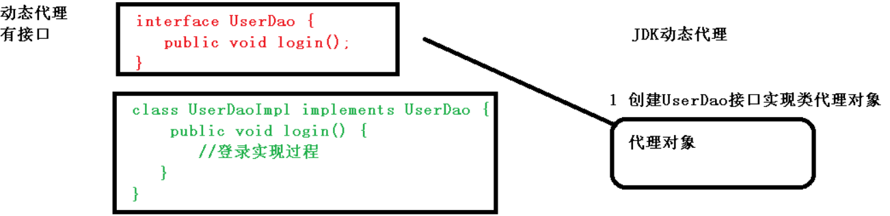

第二种 没有接口情况，使用CGLIB动态代理

- 创建子类的代理对象，增强类的方法

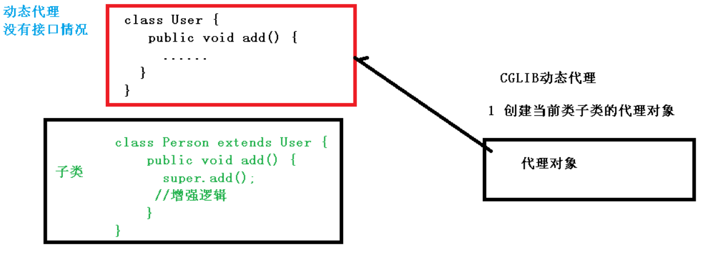

#### AOP（JDK 动态代理）

使用JDK动态代理，使用Proxy类里面的 newProxyInstance 方法创建接口实现类的代理对象

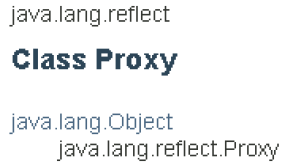

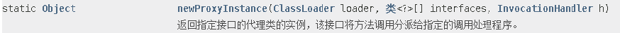

方法的三个参数：

* 类加载器
* 增强方法所在的类，这个类实现的接口，支持多个接口
* 实现接口 InvocationHandler ，创建代理对象，写增强的部分

##### JDK 动态代理实现代码

1. 创建接口，定义方法

```java
public interface UserDao { 
    public int add(int a,int b); 
    public String update(String id); 
}
```

2. 创建接口实现类，实现方法

```java
public class UserDaoImpl implements UserDao { 
    @Override 
    public int add(int a, int b) { 
        return a+b; 
    } 
    
    @Override 
    public String update(String id) { 
        return id; 
    } 
}
```

3. 使用Proxy类创建接口代理对象

```java
public class JDKProxy {
    public static void main(String[] args) {
        // 创建接口实现类代理对象
        Class[] interfaces = {UserDao.class};

        UserDaoImpl userDao = new UserDaoImpl();
        UserDao dao = (UserDao) Proxy.newProxyInstance(JDKProxy.class.getClassLoader(), interfaces, new UserDaoProxy(userDao));
        int result = dao.add(1, 1);
        System.out.println("result: " + result);
    }
}

class UserDaoProxy implements InvocationHandler {

    //1 把创建的是谁的代理对象，把谁传递过来
    //有参数构造传递
    private Object object;

    public UserDaoProxy(Object object) {
        this.object = object;
    }

    //增强的逻辑
    @Override
    public Object invoke(Object proxy, Method method, Object[] args) throws Throwable {

        // 方法之前
        System.out.println("方法执行之前..." + method.getName() + " :传递的参数..." + Arrays.toString(args));

        // 被增强的方法执行
        Object res = method.invoke(object, args);

        // 方法之后
        System.out.println("方法执行之后 ..." + object);

        return res;
    }
}

```

#### AOP（术语）

* 连接点（Joinpoint）

  一个类或一段程序代码拥有一些具有边界性质的特定点，这些点中的特定点就称为“连接点”。Spring仅支持方法的连接点，即仅能在方法调用前、方法调用后、方法抛出异常时以及方法调用前后这些程序执行点织入通知。

  通俗一点讲，类里面哪些方法可以被增强，这些方法就被称为连接点。

* 切点（pointcut）

  连接点是一个比较空泛的概念，就是定义了哪一些地方是可以切入的，也就是所有允许你通知的地方。

  切点就是定义了通知被应用的位置 （配合通知的方位信息，可以确定具体连接点）。

  实际被真正增强的方法。

* 通知（Advice）

  实际增强的逻辑代码部分，比如我在一个用户登录模块增加了一个权限验证功能，则该功能就称为通知/增强。

  > 通知类型
  >
  > 前置通知（Before）：在目标方法被调用之前调用通知功能；
  >
  > 后置通知（After）：在目标方法完成之后调用通知，此时不会关心方法的输出是什么；
  >
  > 返回通知（After-returning）：在目标方法成功执行之后调用通知；
  >
  > 异常通知（After-throwing）：在目标方法抛出异常后调用通知；
  >
  >  环绕通知（Around）：通知包裹了被通知的方法，在被通知的方法调用之前和调用之后执行自定义的行为。

* 代理（proxy）

  一个类被AOP织入通知后，就产出了一个结果类，它是**融合了原类和通知逻辑的代理类**。根据不同的代理方式，代理类既可能是和原类具有相同接口的类，也可能就是原类的子类，所以我们可以采用调用原类相同的方式调用代理类。

* 切面（Aspect）

  把通知应用到切点的过程

#### AOP操作（相关）

##### Spring 一般是基于 AspectJ 实现 AOP 操作

AspectJ 不是 Spring 的组成部分，是独立的 AOP 框架，一般把 AspectJ 和 Spirng 框架一起使用，进行 AOP 操作

##### 基于AspectJ实现AOP操作

* 基于 xml 配置文件方法
* 基于注解方式（常用）

##### AOP 相关依赖

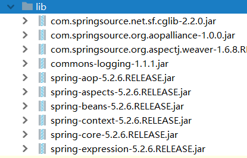

##### 切入点表达式

切入点表达式作用：知道对哪个类里面的哪个方法进行增强

语法结构： execution\(\[权限修饰符\] \[返回类型\] \[类全路径\] \[方法名称\]\(\[参数列表\]\)\)

> 举例
>
> 1. 对com.atguigu.dao.BookDao类里面的add进行增强
>
>    execution(* com.atguigu.dao.BookDao.add(..))
>
> 2. 对com.atguigu.dao.BookDao类里面的所有的方法进行增强
>
>    execution(* com.atguigu.dao.BookDao.* (..))
>
> 3. 对com.atguigu.dao包里面所有类，类里面所有方法进行增强
>
>    execution(* com.atguigu.dao.*.* (..))

#### AOP操作（AspectJ 注解）-- 常用

##### 1. 创建类，在类里面定义方法

```java
/**
 * 被增强类
 */
public class User {
    public void add() {
        System.out.println("add ... ...");
    }
}
```

##### 2. 创建增强类，编写增强逻辑

2.1 在增强类里面，创建方法，让不同方法代表不同通知类型

```java
/**
 * 增强类
 */
public class UserProxy {

    /**
     * 前置通知
     */
    public void before() {
        System.out.println("before ... ...");
    }

}
```

##### 3. 进行通知的配置

3.1 在 spring 配置文件中，开启注解扫描

```xml
<?xml version="1.0" encoding="UTF-8"?>
<beans xmlns="http://www.springframework.org/schema/beans"
       xmlns:xsi="http://www.w3.org/2001/XMLSchema-instance"
       xmlns:context="http://www.springframework.org/schema/context"
       xmlns:aop="http://www.springframework.org/schema/aop"
       xsi:schemaLocation="http://www.springframework.org/schema/beans http://www.springframework.org/schema/beans/spring-beans.xsd
                           http://www.springframework.org/schema/context  http://www.springframework.org/schema/context/spring-context.xsd
                           http://www.springframework.org/schema/aop  http://www.springframework.org/schema/aop/spring-aop.xsd">
    
    <context:component-scan base-package="com.joeyhu.spring5.aopanno"></context:component-scan>
```

3.2 使用注解创建 User 和 UserProxy 对象

```java
@Component
public class User {
    ...
}

@Component
public class UserProxy {
    ...
}
```

3.3 在增强类上面添加注解 @Aspect

```java
@Component
@Aspect  // 生成代理对象
public class UserProxy {
    ...
}
```

3.4 在 spring 配置文件中开启生成代理对象

```xml
<!-- 开启Aspect生成代理对象-->
<aop:aspectj-autoproxy></aop:aspectj-autoproxy>
```

##### 4. 配置不同类型通知

4.1 在增强类的里面，在作为通知方法上面添加通知类型注解，使用切入点表达式配置

```java
@Component
@Aspect  // 生成代理对象
public class UserProxy {

    /**
     * 前置通知
     */
    @Before(value = "execution(* com.joeyhu.spring5.aopanno.User.add(..))")
    public void before() {
        System.out.println("before ... ...");
    }

    @After(value = "execution(* com.joeyhu.spring5.aopanno.User.add())")
    public void after() {
        System.out.println("after ... ...");
    }

    @AfterReturning(value = "execution(* com.joeyhu.spring5.aopanno.User.add())")
    public void afterReturning() {
        System.out.println("afterReturning ... ...");
    }

    @AfterThrowing(value = "execution(* com.joeyhu.spring5.aopanno.User.add())")
    public void afterThrowing() {
        System.out.println("afterThrowing ... ...");
    }

    @Around(value = "execution(* com.joeyhu.spring5.aopanno.User.add())")
    public void aroud(ProceedingJoinPoint proceedingJoinPoint) throws Throwable {
        System.out.println("before around ... ...");

        // 被增强方法执行
        proceedingJoinPoint.proceed();

        System.out.println("after around ... ...");
    }
}
```

输出结果（无异常）：

```mark
before around ... ...
before ... ...
add ... ...
after around ... ...
after ... ...
afterReturning ... ...
```

输出结果（存在异常）：

```markdo
before around ... ...
before ... ...
after ... ...
afterThrowing ... ...

java.lang.ArithmeticException: / by zero

	at com.joeyhu.spring5.aopanno.User.add(User.java:17)
	at com.joeyhu.spring5.aopanno.User$$FastClassBySpringCGLIB$$eb6cd24a.invoke(<generated>)
```

注意观察不同类型通知的执行顺序以及什么情况下执行和什么情况下不执行。

##### 5. 相同的切入点抽取

上面不同类型的通知，注解内部的 value 都是相同的，我们可以把它提取出来成一个单独的方法，加上 @pointcut 注解。

```java
/**
 * 相同切入点提取
 */
@Pointcut(value = "execution(* com.joeyhu.spring5.aopanno.User.add(..))")
public void pointcutDemo() {
}

 @Before("pointcutDemo()")
public void before() {
    System.out.println("before ... ...");
}

@After("pointcutDemo()")
public void after() {
    System.out.println("after ... ...");
}

@AfterReturning("pointcutDemo()")
public void afterReturning() {
    System.out.println("afterReturning ... ...");
}

@AfterThrowing("pointcutDemo()")
public void afterThrowing() {
    System.out.println("afterThrowing ... ...");
}

@Around("pointcutDemo()")
public void aroud(ProceedingJoinPoint proceedingJoinPoint) throws Throwable {
    System.out.println("before around ... ...");

    // 被增强方法执行
    proceedingJoinPoint.proceed();

    System.out.println("after around ... ...");
}
```

##### 6. 有多个增强类对同一个方法进行增强，设置增强类优先级

在增强类上面添加注解 @Order(数字类型值)，数字类型值越小优先级越高

```java
@Component
@Aspect
@Order(1)
public class PriorityProxy {

    @Before(value = "execution(* com.joeyhu.spring5.aopanno.User.add(..))")
    public void before() {
        System.out.println("priority before ... ...");
    }
}
```

```java
@Component
@Aspect  // 生成代理对象
@Order(2)
public class UserProxy {

    /**
     * 相同切入点提取
     */
    @Pointcut(value = "execution(* com.joeyhu.spring5.aopanno.User.add(..))")
    public void pointcutDemo() {

    }
    ... ...
}
```

输出结果：

```markdown
priority before ... ...
before around ... ...
before ... ...
add ... ...
after around ... ...
after ... ...
afterReturning ... ...
```

##### 7. 完全注解开发（不需要配置文件）

创建配置类

```java
package com.joeyhu.spring5.config;

@Configuration
@ComponentScan(basePackages = {"com.joeyhu.spring5"})  // 等价于<context:component-scan base-package="com.joeyhu.spring5.aopanno"></context:component-scan>
@EnableAspectJAutoProxy(proxyTargetClass = true)  // 等价于 <aop:aspectj-autoproxy></aop:aspectj-autoproxy>
public class ConfigAop {
}
```

测试方法：

```java
@Test
public void testAopAnnotation() {
    //        ApplicationContext context = new ClassPathXmlApplicationContext("bean1.xml");
    AnnotationConfigApplicationContext context = new AnnotationConfigApplicationContext(ConfigAop.class);
    User user = context.getBean("user", User.class);
    user.add();
}
```

#### AOP操作（AspectJ 配置文件） -- 了解即可

 

### JDBCTemplate

Spring 框架对 JDBC 进行封装，使用 JdbcTemplate 方便实现对数据库操作

> [JDBC详细介绍](https://blog.csdn.net/jungle_rao/article/details/81274720)

#### JDBCTemplate 准备工作

##### 1. 引入 jar 包

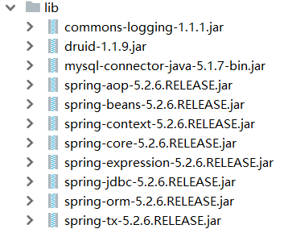

##### 2. 在 Spring 配置文件中配置数据库连接池

```xml
<!--数据库连接池-->
<bean id="dataSource" class="com.alibaba.druid.pool.DruidDataSource" destroy-method="close">
    <property name="driverClassName" value="com.mysql.jdbc.Driver"></property>
    <property name="url" value="jdbc:mysql://localhost:3306/mydb_test"></property>
    <property name="username" value="root"></property>
    <property name="password" value="hh123456"></property>
</bean>
```

##### 3. 配置JdbcTemplate对象，注入DataSource

```xml
<!--jdbcTemplate对象-->
<bean id="jdbcTemplate" class="org.springframework.jdbc.core.JdbcTemplate">
    <!--注入dataSource-->
    <property name="dataSource" ref="dataSource"></property>
</bean>
```

##### 4. 创建 service 类，创建 dao 类，在 dao 注入 jdbcTemplate 对象

配置文件

```xml
<!--组件扫描-->
<context:component-scan base-package="com.joeyhu.spring5"></context:component-scan>
```

service层

```java
@Service
public class BookService {

    /**
     * 注入Dao
     */
    @Autowired
    private BookDao bookDao;
}
```

dao层

```java
@Repository
public class BookDaoImpl implements BookDao {

    /**
     * 注入JDBCTemplate
     */
    @Autowired
    private JdbcTemplate jdbcTemplate;
}
```

#### JDBCTemplate 操作数据库（添加）

##### 1. 对应数据库创建实体类

```JAVA
package com.joeyhu.spring5.entity;

/**
 * @author: huhao
 * @time: 2020/8/12 16:34
 * @desc:
 */
public class Book {

    private String bNo;
    private String bName;
    private String bAuthor;

    public String getbNo() {
        return bNo;
    }

    public void setbNo(String bNo) {
        this.bNo = bNo;
    }

    public String getbName() {
        return bName;
    }

    public void setbName(String bName) {
        this.bName = bName;
    }

    public String getbAuthor() {
        return bAuthor;
    }

    public void setbAuthor(String bAuthor) {
        this.bAuthor = bAuthor;
    }

    @Override
    public String toString() {
        return "Book{" +
                "bNo='" + bNo + '\'' +
                ", bName='" + bName + '\'' +
                ", bAuthor='" + bAuthor + '\'' +
                '}';
    }
}

```

##### 2. 编写 service 和 dao

2.1 在 dao 进行数据库添加操作

2.2 调用 JdbcTemplate 对象里面 update 方法实现添加操作

方法 `update(String sql, Object... args)`

参数一：sql 语句

参数二：可变参数，sql 替代值

dao层

```java
public interface BookDao {
    public void addBook(Book book);
}
```

```java
@Repository
public class BookDaoImpl implements BookDao {

    /**
     * 注入JDBCTemplate
     */
    @Autowired
    private JdbcTemplate jdbcTemplate;

    /**
     * 添加
     * @param book
     */
    @Override
    public void addBook(Book book) {

        String sql = "INSERT INTO book values (?, ?, ?);";

        // 调用 update 方法
        Object[] args = {book.getbNo(), book.getbName(), book.getbAuthor()};
        int update = jdbcTemplate.update(sql, args);
        System.out.println(update);
    }
}
```

service层

```java
@Service
public class BookService {

    /**
     * 注入Dao
     */
    @Autowired
    private BookDao bookDao;

    public void addBook(Book book){
        bookDao.addBook(book);
    }
}
```

##### 3. 测试方法

```java
@Test
public void testAdd() {

    ApplicationContext context = new ClassPathXmlApplicationContext("bean1.xml");
    BookService bookService = context.getBean("bookService", BookService.class);
    Book book = new Book();
    book.setbNo("1");
    book.setbName("人类的群星闪耀时");
    book.setbAuthor("史蒂芬茨威格");
    bookService.addBook(book);
}
```

#### JDBCTemplate 操作数据库（修改和删除）

与添加方法类似

```java
/**
 * 修改
 * @param book
 */
@Override
public void updateBook(Book book) {
    String sql = "UPDATE book set bName=?, bAuthor=? WHERE bNo=?;";
    Object[] args =  {book.getbName(), book.getbAuthor(), book.getbNo()};
    int update = jdbcTemplate.update(sql, args);
    System.out.println(update);
}

/**
 * 删除
 * @param id
 */
@Override
public void deleteBook(String id) {
    String sql = "DELETE FROM book WHERE bNo=?";
    int update = jdbcTemplate.update(sql, id);
    System.out.println(update);
}
```

#### JDBCTemplate 操作数据库（查询返回单个值）

场景：查询表里面有多少条记录，返回数值

JdbcTemplate 实现查询返回某个值方法： `querForObject(String sql, Class<T> requiredType)`

参数一：sql 语句

参数二: 要返回类型的 class

```java
/**
 * 查询表的记录数
 */
@Override
public int selectCount() {
    String sql = "SELECT COUNT(bNO) FROM book;";
    Integer query = jdbcTemplate.queryForObject(sql, Integer.class);
    return query;
}
```

#### JDBCTemplate 操作数据库（查询返回对象）

场景：查询图书详情

JdbcTemplate 实现查询返回对象方法：``querForObject(String sql, RowMapper<T> rowMapper, Object... args)`

参数一：sql 语句

参数二：RowMapper 是接口，针对返回不同类型数据，使用这个接口里面实现类完成数据封装

参数三：sql语句值

```java
/**
 * 查询单个记录
 * @param id
 * @return
 */
@Override
public Book selectSingleBook(String id) {
    String sql = "SELECT * FROM book WHERE bNo=?;";
    Book book = jdbcTemplate.queryForObject(sql, new BeanPropertyRowMapper<Book>(Book.class), id);
    return book;
}
```

#### JDBCTemplate 操作数据库（查询返回集合）

场景：查询图书列表分页…

JdbcTemplate 实现查询返回对象方法：``query(String sql, RowMapper<T> rowMapper, Object... args)`

参数一：sql 语句

参数二：RowMapper 是接口，针对返回不同类型数据，使用这个接口里面实现类完成数据封装

参数三：sql语句值

```java
/**
 * 查询所有记录
 * @return
 */
@Override
public List<Book> selectAllBooks() {
    String sql = "SELECT * FROM book;";
    List<Book> query = jdbcTemplate.query(sql, new BeanPropertyRowMapper<>(Book.class));
    return query;
}
```

#### JDBCTemplate 操作数据库（批量操作）

操作表中多条记录

JdbcTemplate 实现批量操作记录方法：`batchUpdate(String sql, List<Object[]> batchArgs)`

参数一：sql 语句

参数二：数组的List 集合，要操作的多条记录

dao层

```java
/**
 * 批量添加
 * @param batchArgs
 */
@Override
public void batchAddBooks(List<Object[]> batchArgs) {
    String sql = "INSERT INTO book VALUES(?, ?, ?);";
    int[] ints = jdbcTemplate.batchUpdate(sql, batchArgs);
    System.out.println(Arrays.toString(ints));
}

/**
 * 批量修改
 * @param batchArgs
 */
@Override
public void batchUpdateBooks(List<Object[]> batchArgs) {
    String sql = "UPDATE book SET bName=?, bAuthor=? WHERE bNo=?;";
    int[] ints = jdbcTemplate.batchUpdate(sql, batchArgs);
    System.out.println(Arrays.toString(ints));
}

/**
 * 批量删除
 * @param batchArgs
 */
@Override
public void batchDeleteBooks(List<Object[]> batchArgs) {
    String sql = "DELETE FROM book WHERE bNo=?;";
    int[] ints = jdbcTemplate.batchUpdate(sql, batchArgs);
    System.out.println(Arrays.toString(ints));
}
```

测试方法（批量更新方法，其余类似）

```java
@Test
public void testBatchUpdateBooks() {

    ApplicationContext context = new ClassPathXmlApplicationContext("bean1.xml");
    BookService bookService = context.getBean("bookService", BookService.class);
    List<Object[]> batchArgs = new ArrayList<>();
    Object[] o1 = {"神雕侠侣", "金老", "3"};
    Object[] o2 = {"射雕英雄传", "金老", "4"};
    Object[] o3 = {"雪山飞狐", "金老", "5"};
    batchArgs.add(o1);
    batchArgs.add(o2);
    batchArgs.add(o3);
    bookService.batchUpdateBooks(batchArgs);
}
```

### 事务（Transaction）

#### 事务相关概念

事务是一组操作序列，是数据库操作的不可分割的基本单元，要么都执行，要么都不执行。

事务基本属性（ACID）：

> 原子性（atomicity）：一个事务是一个不可分割的工作单位，事务中包括的诸操作要么都做，要么都不做。
>
> 一致性（consistency）：事务必须是使数据库从一个一致性状态变到另一个一致性状态。一致性与原子性是密切相关的。
>
> 隔离性（isolation）：一个事务的执行不能被其他事务干扰。即一个事务内部的操作及使用的数据对并发的其他事务是隔离的，并发执行的各个事务之间不能互相干扰。
>
> 持久性（durability）：指一个事务一旦提交，它对数据库中数据的改变就应该是永久性的。接下来的其他操作或故障不应该对其有任何影响。

#### 事务操作（转账）

dao 层：实现数据库操作：1. 存入钱；2. 支出钱

service 层：业务操作：实现转账：调用 dao 层的两个方法

* 1 创建数据库表，添加记录

* 2 创建 service，搭建 dao，完成对象创建和注入关系 

  * service 注入 dao，在 dao 注入 JdbcTemplate，在 JdbcTemplate 注入 DataSource

```xml
<?xml version="1.0" encoding="UTF-8"?>
<beans xmlns="http://www.springframework.org/schema/beans"
       xmlns:xsi="http://www.w3.org/2001/XMLSchema-instance"
       xmlns:context="http://www.springframework.org/schema/context"
       xsi:schemaLocation="http://www.springframework.org/schema/beans http://www.springframework.org/schema/beans/spring-beans.xsd
                           http://www.springframework.org/schema/context  http://www.springframework.org/schema/context/spring-context.xsd">

    <!--组件扫描-->
    <context:component-scan base-package="com.joeyhu.spring5"></context:component-scan>


    <!--数据库连接池-->
    <bean id="dataSource" class="com.alibaba.druid.pool.DruidDataSource" destroy-method="close">
        <property name="driverClassName" value="com.mysql.jdbc.Driver"></property>
        <property name="url" value="jdbc:mysql://localhost:3306/mydb_test"></property>
        <property name="username" value="root"></property>
        <property name="password" value="hh123456"></property>
    </bean>

    <!--JDBCTemplate对象-->
    <bean id="jdbcTemplate" class="org.springframework.jdbc.core.JdbcTemplate">
        <!--注入dataSource-->
        <property name="dataSource" ref="dataSource"></property>
    </bean>

</beans>
```

```java
  @Service
  public class UserServiceImpl implements UserService {
  
      @Autowired
      private UserDao userDao;
  }
  
  @Repository
  public class UserDaoImpl implements UserDao {
  
      @Autowired
      private JdbcTemplate jdbcTemplate;
  }
```

* 3 在 dao 创建两个方法：多钱和少钱的方法，在 service 创建方法（转账的方法）

```java
@Service
public class UserServiceImpl implements UserService {

    @Autowired
    private UserDao userDao;

    @Override
    public void transfer() {
        userDao.reduceMoney();

        userDao.addMoney();
    }
}

@Repository
public class UserDaoImpl implements UserDao {

    @Autowired
    private JdbcTemplate jdbcTemplate;

    @Override
    public void addMoney() {
        String sql = "UPDATE account set money=money+? WHERE name=?;";
        int i = jdbcTemplate.update(sql, 100, "Adam");
        if (i == 1){
            System.out.println("转入钱成功。");
        }
        else{
            System.out.println("转入钱失败。");
        }
    }

    @Override
    public void reduceMoney() {
        String sql = "UPDATE account set money=money-? WHERE name=?;";
        int i = jdbcTemplate.update(sql, 100, "Bob");
        if (i == 1){
            System.out.println("转出钱成功。");
        }
        else{
            System.out.println("转出钱失败。");
        }

    }
}
```

上面代码可能会产生一些问题，即当在 service 的两个方法之间出现了异常，会造成不一致的问题。

解决办法：引入事务

```java
try{
    
    // 1. 开启事务
    // 2. 进行业务操作
    // 3. 没有异常，提交事务
    
}catch(Exception e){
    
    // 4. 发生异常，事务回滚
    
}
```

#### 事务操作（Spring 事务管理介绍）

1. 事务添加到JavaEE三层结构里面Service层（业务逻辑层）

2. 在Spring进行事务管理操作
   （1）有两种方式：编程式事务管理和声明式事务管理（使用）

3. 声明式事务管理
   （1）基于注解方式（使用）
   （2）基于xml配置文件方式

4. 在Spring进行声明式事务管理，底层使用AOP原理

5. Spring事务管理API
   （1）提供一个接口，代表事务管理器，这个接口针对不同的框架提供不同的实现类

   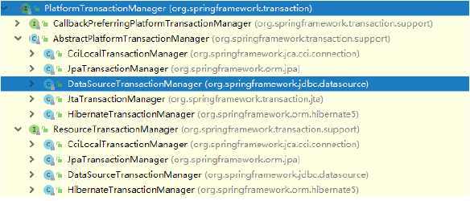

### 事务操作（注解声明式事务管理）

##### 1. 在Spring 配置文件中配置事务管理器

```xml
<!--创建事务管理器-->
<bean id="transactionManager" class="org.springframework.jdbc.datasource.DataSourceTransactionManager">
    <property name="dataSource" ref="dataSource"></property>
</bean>
```

##### 2. 在spring配置文件，开启事务注解
1. 在spring配置文件引入名称空间 tx

```xml
<?xml version="1.0" encoding="UTF-8"?>
<beans xmlns="http://www.springframework.org/schema/beans"
       xmlns:xsi="http://www.w3.org/2001/XMLSchema-instance"
       xmlns:context="http://www.springframework.org/schema/context"
       xmlns:tx="http://www.springframework.org/schema/tx"
       xsi:schemaLocation="http://www.springframework.org/schema/beans http://www.springframework.org/schema/beans/spring-beans.xsd
                           http://www.springframework.org/schema/context  http://www.springframework.org/schema/context/spring-context.xsd
                           http://www.springframework.org/schema/tx  http://www.springframework.org/schema/tx/spring-tx.xsd">
```

2. 开启事务注解

```xml
<!--事务注解-->
<tx:annotation-driven transaction-manager="transactionManager"></tx:annotation-driven>
```

##### 3. 在service类上面（或者service类里面方法上面）添加事务注解

@Transactional，这个注解添加到类上面，也可以添加方法上面。

如果把这个注解添加类上面，这个类里面所有的方法都添加事务；如果把这个注解添加方法上面，为这个方法添加事务。

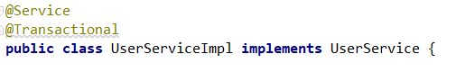

#### 事务操作（声明式事务管理参数配置）

@Transaction 里面的配置事务相关参数

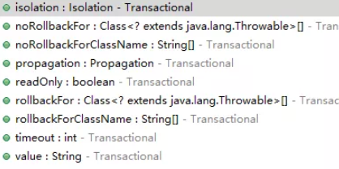

##### propagation：事务传播行为

​	多事务方法直接进行调用，这个过程中事务是如何进行管理的。

##### isolation：事务隔离级别

​	事务有隔离性的特性，多事务操作之间不会产生影响，不考虑隔离性会产生很多问题（脏读、不可重复读、幻读）。

​	脏读：一个未提交事务读取了另一个未提交事务的数据

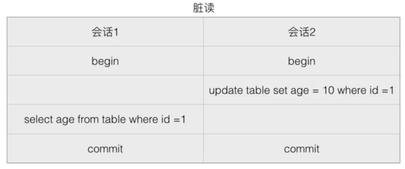

​	如果会话 2 更新 age 为 10，但是在 commit 之前，会话 1 希望得到 age，那么会获得的值就是更新前的值。或者如果会话 2 更新了值但是执行了 rollback，而会话 1 拿到的仍是 10。这就是脏读。

​	不可重复读：个事务读取同一条记录2次，得到的结果不一致

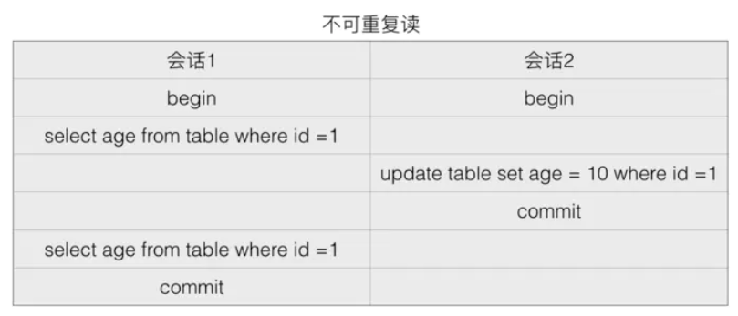

​	由于在读取中间变更了数据，所以会话 1 事务查询期间的得到的结果就不一样了。

​	幻读：一个事务读取2次，得到的记录条数不一致

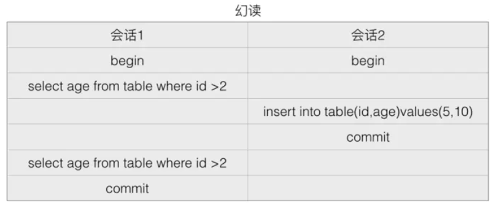

事务1两次读取到的记录条数不一样。

解决：通过设置隔离级别解决读问题

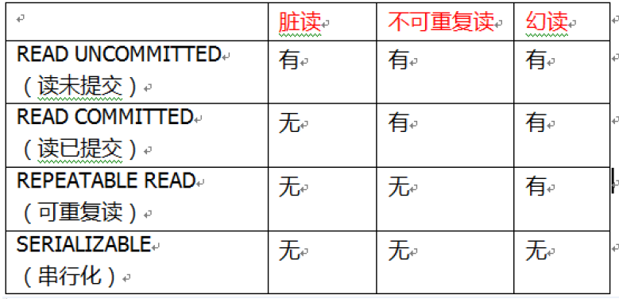

##### timeout：超时时间

事务需要在一定时间内进行提交，如果不提交进行回滚

##### readOnly：是否只读

readOnly 默认值 false，表示可以查询，可以添加修改删除操作

##### rollbackFor：回滚

设置出现哪些异常进行事务回滚

##### noRollbackFor：不回滚

设置出现哪些异常不进行事务回滚

#### 事务操作（XML 声明式事务管理）

#### 事务操作（完全注解声明式事务管理）


 


### Spring 参考路线（尽快看完，做补充）：

- [Java Spring框架是什么？它有哪些好处？](https://link.zhihu.com/?target=https%3A//mp.weixin.qq.com/s%3F__biz%3DMzUxMDI2NjM0Mg%3D%3D%26mid%3D2247483701%26idx%3D1%26sn%3D77c4001892321a54fbf259ef0e49e0a5%26scene%3D21%23wechat_redirect)
- [Spring体系结构详解](https://link.zhihu.com/?target=https%3A//mp.weixin.qq.com/s%3F__biz%3DMzUxMDI2NjM0Mg%3D%3D%26mid%3D2247483705%26idx%3D1%26sn%3Dc57bfff5184393747d91c6907071957f%26scene%3D21%23wechat_redirect)
- [Spring目录结构和基础JAR包介绍](https://link.zhihu.com/?target=https%3A//mp.weixin.qq.com/s%3F__biz%3DMzUxMDI2NjM0Mg%3D%3D%26mid%3D2247483709%26idx%3D1%26sn%3D59fc285cf7121a909db982b66b7b79e1%26scene%3D21%23wechat_redirect)
- [Spring IoC容器：BeanFactory和ApplicationContext](https://link.zhihu.com/?target=https%3A//mp.weixin.qq.com/s%3F__biz%3DMzUxMDI2NjM0Mg%3D%3D%26mid%3D2247483713%26idx%3D1%26sn%3D56fcec2a569462111bceb64255989f50%26scene%3D21%23wechat_redirect)
- [第一个Spring程序](https://link.zhihu.com/?target=https%3A//mp.weixin.qq.com/s%3F__biz%3DMzUxMDI2NjM0Mg%3D%3D%26mid%3D2247483717%26idx%3D1%26sn%3Dbced8b1089fac808d41846059097d8b0%26scene%3D21%23wechat_redirect)
- [Spring DI（依赖注入）的实现方式：属性注入和构造注入](https://link.zhihu.com/?target=https%3A//mp.weixin.qq.com/s%3F__biz%3DMzUxMDI2NjM0Mg%3D%3D%26mid%3D2247483721%26idx%3D1%26sn%3D56c5c696db655fd370ea03ca89226aee%26scene%3D21%23wechat_redirect)
- [Spring Bean的配置及常用属性](https://link.zhihu.com/?target=https%3A//mp.weixin.qq.com/s%3F__biz%3DMzUxMDI2NjM0Mg%3D%3D%26mid%3D2247483725%26idx%3D1%26sn%3D3d0dc7374ba9e752b14aa16db6c332c0%26scene%3D21%23wechat_redirect)
- [Spring实例化Bean的三种方法](https://link.zhihu.com/?target=https%3A//mp.weixin.qq.com/s%3F__biz%3DMzUxMDI2NjM0Mg%3D%3D%26mid%3D2247483732%26idx%3D1%26sn%3D9fd25df570221cf8b846b9a374db472f%26scene%3D21%23wechat_redirect)
- [Spring中Bean的作用域](https://link.zhihu.com/?target=https%3A//mp.weixin.qq.com/s%3F__biz%3DMzUxMDI2NjM0Mg%3D%3D%26mid%3D2247483736%26idx%3D1%26sn%3D6d25d0812e5a725d5a17b58f5ee7c084%26scene%3D21%23wechat_redirect)
- [Spring Bean的生命周期](https://link.zhihu.com/?target=https%3A//mp.weixin.qq.com/s%3F__biz%3DMzUxMDI2NjM0Mg%3D%3D%26mid%3D2247483740%26idx%3D1%26sn%3D48a1d49071b45efe1707751e67e4c4d3%26scene%3D21%23wechat_redirect)
- [Spring基于XML装配Bean](https://link.zhihu.com/?target=https%3A//mp.weixin.qq.com/s%3F__biz%3DMzUxMDI2NjM0Mg%3D%3D%26mid%3D2247483793%26idx%3D1%26sn%3Df44b90b92ade4c746ef4bf924971d640%26scene%3D21%23wechat_redirect)
- [Spring基于Annotation装配Bean](https://link.zhihu.com/?target=https%3A//mp.weixin.qq.com/s%3F__biz%3DMzUxMDI2NjM0Mg%3D%3D%26mid%3D2247483797%26idx%3D1%26sn%3Dd3c61ab6060d90b3657417152385caa3%26scene%3D21%23wechat_redirect)
- [Spring自动装配Bean](https://link.zhihu.com/?target=https%3A//mp.weixin.qq.com/s%3F__biz%3DMzUxMDI2NjM0Mg%3D%3D%26mid%3D2247483801%26idx%3D1%26sn%3Dba9d59f05838bb187999594f8cbdc964%26scene%3D21%23wechat_redirect)
- [Spring AOP（面向切面编程）是什么？](https://link.zhihu.com/?target=https%3A//mp.weixin.qq.com/s%3F__biz%3DMzUxMDI2NjM0Mg%3D%3D%26mid%3D2247483805%26idx%3D1%26sn%3Db55c086e31df1d2fff365cadad150448%26scene%3D21%23wechat_redirect)
- [Spring JDK动态代理（附带实例）](https://link.zhihu.com/?target=https%3A//mp.weixin.qq.com/s%3F__biz%3DMzUxMDI2NjM0Mg%3D%3D%26mid%3D2247483820%26idx%3D1%26sn%3D5168eb2784ffde0941aa7b94548ca36c%26scene%3D21%23wechat_redirect)
- [Spring通知类型及使用ProxyFactoryBean创建AOP代理](https://link.zhihu.com/?target=https%3A//mp.weixin.qq.com/s%3F__biz%3DMzUxMDI2NjM0Mg%3D%3D%26mid%3D2247483828%26idx%3D1%26sn%3D40102e031b0afd2b3fa24ea943818739%26scene%3D21%23wechat_redirect)
- [Spring使用AspectJ开发AOP：基于XML和基于Annotation](https://link.zhihu.com/?target=https%3A//mp.weixin.qq.com/s%3F__biz%3DMzUxMDI2NjM0Mg%3D%3D%26mid%3D2247483832%26idx%3D1%26sn%3Dbfe22b48037a2ff8953e4dc19e531e5a%26scene%3D21%23wechat_redirect)
- [Spring JDBCTemplate简介](https://link.zhihu.com/?target=https%3A//mp.weixin.qq.com/s%3F__biz%3DMzUxMDI2NjM0Mg%3D%3D%26mid%3D2247483836%26idx%3D1%26sn%3D6b43ff47588f6a57257d57451b6ec185%26scene%3D21%23wechat_redirect)
- [Spring事务管理接口](https://link.zhihu.com/?target=https%3A//mp.weixin.qq.com/s%3F__biz%3DMzUxMDI2NjM0Mg%3D%3D%26mid%3D2247483840%26idx%3D1%26sn%3D9e1bfc0b88ece3e8ed299e5d1588335b%26scene%3D21%23wechat_redirect)
- [Spring声明式事务管理（基于XML方式实现）](https://link.zhihu.com/?target=https%3A//mp.weixin.qq.com/s%3F__biz%3DMzUxMDI2NjM0Mg%3D%3D%26mid%3D2247483844%26idx%3D1%26sn%3Df90d1bd2c2517b52addab583f51d76c0%26scene%3D21%23wechat_redirect)
- [Spring声明式事务管理（基于Annotation注解方式实现）](https://link.zhihu.com/?target=https%3A//mp.weixin.qq.com/s%3F__biz%3DMzUxMDI2NjM0Mg%3D%3D%26mid%3D2247483848%26idx%3D1%26sn%3D3505b627b05b83ebfc5e522d56e2da19%26scene%3D21%23wechat_redirect)
- [SSH框架（Struts2+Spring+Hibernate）搭建整合详细步骤](https://link.zhihu.com/?target=https%3A//mp.weixin.qq.com/s%3F__biz%3DMzUxMDI2NjM0Mg%3D%3D%26mid%3D2247483873%26idx%3D1%26sn%3D40bbd3dd18d91347e754108c576d768d%26scene%3D21%23wechat_redirect)
- [测试SSH框架分层整合及验证事务是否有效](https://link.zhihu.com/?target=https%3A//mp.weixin.qq.com/s%3F__biz%3DMzUxMDI2NjM0Mg%3D%3D%26mid%3D2247483877%26idx%3D1%26sn%3Df185e6cee1e40ea84470c5ee1b909491%26scene%3D21%23wechat_redirect)
- [SSM（Spring+Spring MVC+MyBatis）框架整合搭建详细步骤](https://link.zhihu.com/?target=https%3A//mp.weixin.qq.com/s%3F__biz%3DMzUxMDI2NjM0Mg%3D%3D%26mid%3D2247483881%26idx%3D1%26sn%3Dc7e4b9e1556370c3f4bde4d6949a39d7%26scene%3D21%23wechat_redirect)

### 参考：

1. 尚硅谷-Spring5框架2020最新版教程
2. https://www.jianshu.com/p/5015f212e4e4