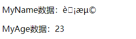
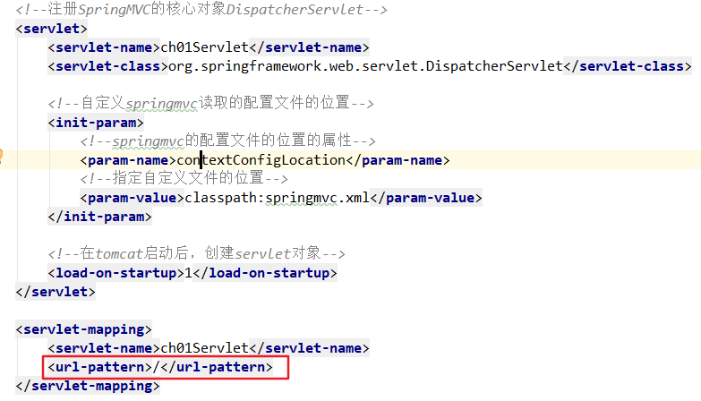
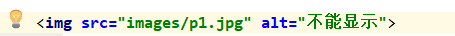

### SpringMVC 概述

#### MVC 模式

”架构模式”（architecture pattern）是一门讲如何实际一个程序的结构的学问。MVC 模式（Model View Controller，模型视图控制器）就是架构模式的一种。**使用控制器将数据模型和视图进行分离，也就是将视图和数据进行解耦**。这样的好处是后端处理的数据模型和前端视图显示的数据格式无关，实现一个数据模型可以对应多个视图以不同的方式来展现数据，当数据模型或视图发生变化时，相互之间的影响也会降低到最低。

MVC  的核心是控制器，控制器与视图和模型相对独立，它起到一个分发请求和返回处理结果的作用，对请求和数据模型的处理一般由 JavaBean 负责。

* Model：数据模型，JavaBean 的类，进行数据封装；
* View：提供给用户的操作界面和用于显示数据的页面；
* Controller：控制器接受用户的输入并调用模型和视图去完成用户的需求，控制器本身不输出任何东西和做任何处理。它只是接收请求并决定调用哪个模型构件去处理请求，然后再确定用哪个视图来显示返回的数据。

三者之间的关系


#### SpringMVC概述

SpringMVC 是 Spring 框架的一部分，是在 Spring3.0 后发布的。

SPringMVC 优点：

* 基于 MVC 框架，功能分工明确，降低耦合度
* SpringMVC 是轻量级的，不依赖特定的接口和类
* 作为 Spring 框架的一部分，SpringMVC 也可以使用 IOC 和 AOP，方便整合 MyBatis等其他框架
* 方便灵活。SpringMVC 强化注解的使用，在控制器、Service、Dao 都可以使用注解。使用 @Controller 创建控制器对象，@Service 创建业务对象，@Repository 创建持久层对象，@Autowired 或者 @Resource 在控制器中注入 Service，Service 中注入 Dao。

#### SpringMVC 简单项目

新建一个 empty project，再在项目中利用 maven 创建一个webapp 项目。

```markdown
需求：用户在页面发起一个请求，请求交给 SpringMVC 的控制器对象，并显示请求的处理结果（在结果页面显示一个欢迎语句）。
```

实现步骤：

##### 1. 新建web maven 工程


##### 2. 加入依赖

spring-webmvc 依赖，间接把 Spring 的依赖加入到项目中

jsp，servlet 依赖


pom.xml文件

```xml
<!--引入servlet依赖-->
    <dependency>
      <groupId>javax.servlet</groupId>
      <artifactId>javax.servlet-api</artifactId>
      <version>3.1.0</version>
      <scope>provided</scope>
    </dependency>

    <!--引入SpringMVC依赖-->
    <dependency>
      <groupId>org.springframework</groupId>
      <artifactId>spring-webmvc</artifactId>
      <version>5.2.5.RELEASE</version>
    </dependency>	
```

更改 web.xml 版本号

在 Project Structure -- Facets -- web -- Deployment Description 中删除原有的 web.xml，新建一个 1web.xml（注意先改个名称，后面再改回 web.xml）。

 

参考：[IDEA更改Maven项目的webapp的版本号](https://blog.csdn.net/qq_31496897/article/details/77186576)

##### 3. 重点： 在web.xml中注册springmvc框架的核心对象DispatcherServlet

​	1) DispatcherServlet 叫做中央调度器，是一个 servlet，它的父类继承HttpServlet

​	2) DispatcherServlet页叫做前端控制器（front controller）

​	3) DispatcherServlet负责接收用户提交的请求， 调用其它的控制器对象，并把请求的处理结果显示给用户

**需要在tomcat服务器启动后，创建DispatcherServlet对象的实例。**

为什么要创建DispatcherServlet对象的实例呢？

因为DispatcherServlet在他的创建过程中， 会同时创建springmvc容器对象，读取springmvc的配置文件，把这个配置文件中的对象都创建好， 当用户发起请求时就可以直接使用对象了。

```markdown
    servlet的初始化会执行init（）方法。 DispatcherServlet在init（）中{
       //创建容器，读取配置文件
       WebApplicationContext ctx = new ClassPathXmlApplicationContext("springmvc.xml");
       //把容器对象放入到ServletContext中
       getServletContext().setAttribute(key, ctx);
    }
```

**servlet 启动顺序：load-on-startup**

load-on-startup：该标签作用是，标记否在WebWeb 服务器（这里是 Tomcat）启动时会创建这个 Servlet 实例，即是否在 Web 服务器启动时调用执行该 Servlet 的 init() 方法，而不是在真正访问时才创建。

大于等于0的整数。

数值越小，tomcat创建对象的时间越早。 

当值相同时，容器会自己选择 创建顺序。

**配置tomcat**

[spring mvc项目配置tomcat](https://blog.csdn.net/qq_22222499/article/details/80248032)

**自定义springmvc读取的配置文件的位置**

DispatcherServlet 注册完毕后，可直接在服务器上发布运行。但此时控制台会抛出 FileNotFoundException 异常。SpringMVC 的默认配置文件是放在 WEB-INF 下的，以[servletname]-servlet.xml 格式命名，但我们希望自己定义配置文件的名称和路径，所以可以使用`<init-param>`来配置。

https://blog.csdn.net/u022812849/article/details/42110283

在工程的类路径下即 src 目录下创建 SpringMVC 的配置文件 springmvc.xml，该文件可以任意命名。


**url-pattern 配置**

使用框架的时候， url-pattern可以使用两种值

1. 使用扩展名方式， 语法 *.xxxx , xxxx是自定义的扩展名。 常用的方式 *.do, *.action, *.mvc等等
       不能使用 *.jsp
       http://localhost:8080/myweb/some.do
       http://localhost:8080/myweb/other.do
  
2. 使用斜杠 "/"

   参考：[SpringMVC的url-pattern配置及原理剖析](https://blog.csdn.net/yongbutingxide/article/details/106770990) 

   ​		   [带你了解DispatcherServlet的url-pattern配置-第一讲](https://shmilyz.github.io/2017/08/24/DispatcherServlet/)

最终 DispatcherServlet 配置

```xml
<?xml version="1.0" encoding="UTF-8"?>
<web-app xmlns="http://xmlns.jcp.org/xml/ns/javaee"
         xmlns:xsi="http://www.w3.org/2001/XMLSchema-instance"
         xsi:schemaLocation="http://xmlns.jcp.org/xml/ns/javaee http://xmlns.jcp.org/xml/ns/javaee/web-app_4_0.xsd"
         version="4.0">

    <!--注册SpringMVC的核心对象DispatcherServlet-->
    <servlet>
        <servlet-name>ch01Servlet</servlet-name>
        <servlet-class>org.springframework.web.servlet.DispatcherServlet</servlet-class>

        <!--自定义springmvc读取的配置文件的位置-->
        <init-param>
            <!--springmvc的配置文件的位置的属性-->
            <param-name>contextConfigLocation</param-name>
            <!--指定自定义文件的位置-->
            <param-value>classpath:springmvc.xml</param-value>
        </init-param>

        <!--在tomcat启动后，创建servlet对象-->
        <load-on-startup>1</load-on-startup>
    </servlet>

    <servlet-mapping>
        <servlet-name>ch01Servlet</servlet-name>
        <url-pattern>*.do</url-pattern>
    </servlet-mapping>
</web-app>
```

##### 4. 创建一个发起请求的页面 index.jsp


##### 5. 创建控制器(处理器)类

​	1) 在类的上面添加 @Controller 注解，创建对象，并加入到 SpringMVC 容器中

​	2) 在类的方法上面加入 @RequestMapping 注解

@Controller：创建处理器对象，对象放在 springmvc 容器中。和 Spring 中的@Service ，@Component一样

@RequestMapping：请求映射，作用是把一个请求地址和一个方法绑定在一起。

​	属性：

​			value：一个 String 数组，表示请求的 URI 地址（some.do）。value 值必须是唯一的，使用时推荐以"/"开头。

​	使用 @RequestMapping 修饰的方法叫做处理器方法或者控制器方法。可以处理请求，类似Servlet中的doGet(), doPost()。

​	返回值：ModelAndView 表示本次请求的处理结果

​			Model: 数据，请求处理完成后，要显示给用户的数据

​			View: 视图， 比如 jsp 等等。

index.jsp

```jsp
<%@ page contentType="text/html;charset=UTF-8" language="java" %>
<html>
<head>
    <title>Title</title>
</head>
<body>
    <p>First SpringMVC Project</p>
    <p> <a href="some.do">发起some.do的请求</a> </p>

</body>
</html>
```

MyController.java

```java
@Controller
public class MyController {
    @RequestMapping(value = "/some.do")
    public ModelAndView doSome() {
        ModelAndView mv = new ModelAndView();

        // 添加数据，框架在请求的最后把数据放入到 request 作用域。相当于 request.setAttribute("msg", "使用 springMVC 进行 web 开发")
        // ModelAndView.addObject(String attributeName, Object attributeValue )
        mv.addObject("msg", "使用 springMVC 进行 web 开发");
        mv.addObject("fun", "执行 doSome 方法");

        // 指定视图，指定视图的完整路径  框架对视图执行 forward 操作，request.getRequestDispatcher("/show.jsp").forward(...)
        mv.setViewName("/show.jsp");

        return mv;
    }
}
```

##### 6. 创建一个作为结果的jsp，显示请求的处理结果

show.jsp

```jsp
<%@ page contentType="text/html;charset=UTF-8" language="java" %>
<html>
<head>
    <title>Title</title>
</head>
<body>
    <p>show.jsp 从 request 作用域获取数据</p>
    <p>msg数据：${msg}</p>
    <p>fun数据：${fun}</p>
</body>
</html>

```

##### 7. 创建 SpringMVC 的配置文件（和 Spring 的配置文件一样）

​	1）声明组建扫描器，指定 @Controller 注解所在的包名

​	2）声明视图解析器，帮助处理视图。

springmvc.xml

```xml
<context:component-scan base-package="com.joeyhu.controller"></context:component-scan>
```

##### 8. 该简单项目的请求处理流程

1）发起some.do

2）tomcat(web.xml--url-pattern知道 *.do的请求给DispatcherServlet)

3）DispatcherServlet（根据springmvc.xml配置知道 some.do---doSome()）

4）DispatcherServlet把some.do转发个MyController.doSome()方法

5）框架执行doSome（）把得到ModelAndView进行处理， 转发到show.jsp

简单概括

some.do -- DispatcherServlet -- MyController

##### 配置视图解析器

此时在浏览器中直接输入http://localhost:8080/ch01_hello_springmvc/show.jsp 是可以直接访问 show.jsp 页面的。


为了避免上面问题的发生，可以将 show.jsp 放到 WEB-INF 目录下。具体做法：在 WEB-INF 目录下建立 view 目录，将show.jsp 放到该目录下，然后修改控制器类指定视图方法，这样就不能直接访问了。


  

**视图解析器**

SpringMVC 框架为了避免对于请求资源路径与扩展名上的冗余，在视图解析器 InternalResouceViewResolver  中引入了请求的前辍与后缀。而 ModelAndView 中只需给出要跳转页面的文件名即可，对于具体路径与扩展视图解析器会自动完成拼接。

首先现在 SpringMVC 配置文件中注册视图解析器：

springmvc.xml

```xml
<!--注册SpringMVC框架中的视图解析器-->
<bean class="org.springframework.web.servlet.view.InternalResourceViewResolver">
    <!--前缀：视图文件的路径-->
    <property name="prefix" value="/WEB-INF/view/"></property>
    <!--后缀：表示视图文件的扩展名-->
    <property name="suffix" value=".jsp"></property>
</bean>
```

修改控制器方法：

MyController.java：

```java
// 当配置了视图解析器时，指定视图路径
// 框架会使用视图解析器的前缀 + 视图名称 + 视图解析器后缀组成完整路径
mv.setViewName("show");
```

一个 Controller 中可以有多个控制器方法，一个控制器方法的 @RequestMapping 的属性 value 可以匹配多个请求。

index.jsp

```jsp
<%@ page contentType="text/html;charset=UTF-8" language="java" %>
<html>
<head>
    <title>Title</title>
</head>
<body>
    <p>First SpringMVC Project</p>
    <p> <a href="some.do">发起some.do的请求</a> </p>
    <p> <a href="first.do">发起first.do的请求</a> </p>
    <p> <a href="other.do">发起other.do的请求</a> </p>
    <p> <a href="second.do">发起second.do的请求</a> </p>
</body>
</html>

```

MyController.java

```java
@Controller
public class MyController {

    @RequestMapping(value = {"/some.do", "/first.do"})  // 斜杠 / 表示 http://localhost:8080/ch01_hello_springmvc
    public ModelAndView doSome() {
        ModelAndView mv = new ModelAndView();

        // 添加数据，框架在请求的最后把数据放入到 request 作用域。相当于 request.setAttribute("msg", "使用 springMVC 进行 web 开发")
        // ModelAndView.addObject(String attributeName, Object attributeValue )
        mv.addObject("msg", "使用 springMVC 进行 web 开发");
        mv.addObject("fun", "执行 doSome 方法");

        // 指定视图，指定视图的完整路径  框架对视图执行 forward 操作，request.getRequestDispatcher("/show.jsp").forward(...)
        // mv.setViewName("/WEB-INF/view/show.jsp");

        // 当配置了视图解析器时，指定视图路径
        // 框架会使用视图解析器的前缀 + 视图名称 + 视图解析器后缀组成完整路径
        mv.setViewName("show");
        return mv;
    }

    @RequestMapping(value = {"/other.do", "/second.do"})
    public ModelAndView doOther() {
        ModelAndView mv = new ModelAndView();


        mv.addObject("msg", "使用 springMVC 进行 web 开发");
        mv.addObject("fun", "执行 doOther 方法");
        mv.setViewName("other");
        return mv;
    }
}
```

#### SpringMVC 执行流程

 web 开发底层是 servlet，springMVC 中有一个对象是 servlet：Dispatcher（中央调度器），主要用于接受用户的**所有请求**，用户把请求给 DispatcherServlet，之后 DispacherServlet 把请求转发给对应 Controller 对象（@Controller 注解创建的对象），最后由 Controller 对象处理请求。


1.用户发送请求至前端控制器DispatcherServlet

 2.DispatcherServlet收到请求调用处理器映射器HandlerMapping。

 3.处理器映射器根据请求url找到具体的处理器，生成处理器执行链HandlerExecutionChain(包括处理器对象和处理器拦截器)一并返回给DispatcherServlet。

 4.DispatcherServlet根据处理器Handler获取处理器适配器HandlerAdapter执行HandlerAdapter处理一系列的操作，如：参数封装，数据格式转换，数据验证等操作

 5.执行处理器Handler(Controller，也叫页面控制器)。

 6.Handler执行完成返回ModelAndView

 7.HandlerAdapter将Handler执行结果ModelAndView返回到DispatcherServlet

 8.DispatcherServlet将ModelAndView传给ViewReslover视图解析器

 9.ViewReslover解析后返回具体View

 10.DispatcherServlet对View进行渲染视图（即将模型数据model填充至视图中）。

 11.DispatcherServlet响应用户。


### SpringMVC 注解式开发

#### @RequestMapping定义请求规则

##### **指定模块名称**

通过 @RequestMapping 注解可以定义处理器对于请求的映射规则。该注解可以在方法上 ，也可以注解在类上 ，但意义是不同的。

一个控制器类可以有多个控制器方法，一个控制器方法的匹配规则可以有多个 URI，当这些 URI 请求有相同的部分时，可以抽取到注解在类上的 @RequestMapping 的 value 属性中。


处理后：


##### **对请求提交方式的定义**

@RequestMapping 的属性 method 用于所对所处理请求的提交方式进行限定，只有满足该 method 属性指定的提交方式请求，才会执行该被注解法。 值是 RequestMethod 枚举常量, 常用的有 RequestMethod.GET 和 RequestMethod.POST。如果不指定 method 属性，则 GET 方式和 POST 方式均可匹配。

Controller: 

```java
// 指定some.do 使用 get 请求方式
@RequestMapping(value = "/some.do", method = RequestMethod.GET)
public ModelAndView doSome() {
    ModelAndView mv = new ModelAndView();

    mv.addObject("msg", "使用 springMVC 进行 web 开发");
    mv.addObject("fun", "执行 doSome 方法");

    mv.setViewName("show");
    return mv;
}

// 指定other.do 使用 post 请求方式
@RequestMapping(value = "/other.do", method = RequestMethod.POST)
public ModelAndView doOther() {
    ModelAndView mv = new ModelAndView();

    mv.addObject("msg", "使用 springMVC 进行 web 开发");
    mv.addObject("fun", "执行 doOther 方法");
    mv.setViewName("other");
    return mv;
}

// 不指定请求提交方式 -- get和post方式均可
@RequestMapping(value = "/first.do")
public ModelAndView doFirst() {
    ModelAndView mv = new ModelAndView();

    mv.addObject("msg", "使用 springMVC 进行 web 开发");
    mv.addObject("fun", "执行 doFirst 方法");
    mv.setViewName("other");
    return mv;
}
```

jsp: 

```jsp
<p> <a href="test/some.do">发起some.do的get请求</a> </p>
<form action="test/other.do" method="post">
    <input type="submit" value="post请求other.do">
</form>
<p> <a href="test/first.do">发起first.do的请求</a> </p>
```

当 jsp 和 controller 请求提交方式不匹配时，会报错：

HTTP Status 405 - Request method not supported

#### 处理器方法的参数

处理器方法可以包含以下四类参数，可在方法内直接使用。

* HttpServletRequest
* HttpServletResponse
* HttpSession
* 请求中所携带的参数（用户）

前三种类型参数可直接用以下方式接受：

```java
@RequestMapping(value = "/first.do")
public ModelAndView doFirst(HttpServletRequest request, HttpServletResponse response, HttpSession session) {
    ModelAndView mv = new ModelAndView();

    mv.addObject("msg", "使用 springMVC 进行 web 开发" + request.getParameter("name") + "||" + response + "||" + session);
    mv.addObject("fun", "执行 doFirst 方法");
    mv.setViewName("other");
    return mv;
}
```

接受用户提交的参数，主要有两种方法：

* 逐个接收
* 对象接收

##### **逐个接收参数**

要保证请求参数名和该请求处理方法的形参名保持一致。

index.jsp

```jsp
<%@ page contentType="text/html;charset=UTF-8" language="java" %>
<html>
<head>
    <title>Title</title>
</head>
<body>
    <p>Recieve User Parameters</p>
    <form action="other.do" method="post">
        姓名：<input type="text" name="name"> <br>
        年龄：<input type="text" name="age"> <br>
        <input type="submit" value="提交参数">
    </form>
</body>
</html>
```

Controller.java

```java
@Controller
public class MyController {
    // 指定other.do 使用 post 请求方式
    @RequestMapping(value = "/other.do", method = RequestMethod.POST)
    public ModelAndView doOther(String name, Integer age) {
        ModelAndView mv = new ModelAndView();

        mv.addObject("MyName", name);
        mv.addObject("MyAge", age);
        mv.setViewName("other");
        return mv;
    }
}
```

show.jsp

```jsp
<%@ page contentType="text/html;charset=UTF-8" language="java" %>
<html>
<head>
    <title>Title</title>
</head>
<body>
    <p>/WEB-INF/view/other.jsp 从 request 作用域获取数据</p>
    <p>MyName数据：${MyName}</p>
    <p>MyAge数据：${MyAge}</p>
</body>
</html>
```

框架接收请求参数

1. 使用request对象接收请求参数

   String strName = request.getParameter("name");
   
   String strAge = request.getParameter("age");
   
2. springmvc框架通过 DispatcherServlet 调用 MyController的doSome()方法
  
   调用方法时，按名称对应，把接收的参数赋值给形参
   
   ​	doSome（strName，Integer.valueOf(strAge)）框架会提供类型转换的功能，能把String转为 int ，long ， float， double等类型。

> 400状态码是客户端错误， 表示提交请求参数过程中，发生了问题。

##### **POST 请求提交方式中文乱码问题**

对于 GET 请求方式，结果显示不存在乱码问题，而 POST 请求提交方式有。



在原始 Servlet 中是这样 解决乱码问题的：

```java
public void doGet(HttpServletRequest request) {
    request.setCharacterEncoding("utf-8");
}
```

弊端在于该方法需要在每一个请求方法中都要加 setCharacterEncoding 语句，比较繁琐。

在 Spring 中，对于请求参数中文乱码问题给出了专门的**字符集过滤集**：spring-web-5.2.5.RELEASE.jar 的 org.springframework.web.filter 包下的 CharacterEncodingFilter 。

解决：

直接在 web.xml 中注册字符集过滤器，最好将其注册在其他过滤器之前，因为过滤器的执行是按照其注册顺序进行的。

```xml
<!--注册字符集过滤器，解决中文乱码问题-->
<filter>
    <filter-name>characterEncodingFilter</filter-name>
    <filter-class>org.springframework.web.filter.CharacterEncodingFilter</filter-class>

    <!--设置项目中使用的字符编码-->
    <init-param>
        <param-name>encoding</param-name>
        <param-value>utf-8</param-value>
    </init-param>

    <!--强制请求对象(HttpServletRequest) 使用encoding 编码的值-->
    <init-param>
        <param-name>forceRequestEncoding</param-name>
        <param-value>true</param-value>
    </init-param>

    <!--强制应答对象(HttpServletResponse) 使用encoding 编码的值-->
    <init-param>
        <param-name>forceResponseEncoding</param-name>
        <param-value>true</param-value>
    </init-param>
</filter>

<!--表示强制所有请求先通过过滤器处理-->
<filter-mapping>
    <filter-name>characterEncodingFilter</filter-name>
    <url-pattern>/*</url-pattern>
</filter-mapping>
```

##### **校正请求参数名请求参数名 @RequestParam**

如果请求 URL 携带的参数名称和处理方法中的参数名不相同时，可以通过在处理方法的形参前添加 @RequestParam(value = "请求参数名") 注解，指定请求 URL 所携带参数的名称。**require** 参数默认为 true，表示请求中必须有此参数，False 表示可以没有此参数。

index.jsp

```jsp
<form action="recieveParam.do" method="post">
    姓名：<input type="text" name="hname"> <br>
    年龄：<input type="text" name="hage"> <br>
    <input type="submit" value="提交参数">
</form>
```

controller

```java
 @RequestMapping(value = "/recieveParam.do", method = RequestMethod.POST)
public ModelAndView recieveParam(@RequestParam(value = "hname", required = false) String name, @RequestParam(value = "hage", required = false) Integer age) {
    ModelAndView mv = new ModelAndView();

    mv.addObject("MyName", name);
    mv.addObject("MyAge", age);
    mv.setViewName("other");
    return mv;
}
```

##### **对象参数接收**

当请求所携带的参数有多个时，使用逐个接收方法就得在请求处理方法中定义多个形参，过于繁琐。此时可以采用对象接收方式。

请求处理方法的形参是 java 对象，对象的属性名必须和请求中参数名是一致的；

```java
@RequestMapping(value = "/recieveObject.do")
public ModelAndView recieveObject(Student student) {
    ModelAndView mv = new ModelAndView();

    mv.addObject("MyName", student.getName());
    mv.addObject("MyAge", student.getAge());
    mv.addObject("MyStudent", student);
    mv.setViewName("other");
    return mv;
}
```

#### 处理器方法的返回值

使用 @controller 注解的处理器的处理器方法，返回值一般有以下四种：

* ModelAndView
* String
* 无返回值 void
* 返回自定义类型对象

##### 返回 ModelAndView

如果处理器方法处理完后，既要跳转到其他资源，又要在跳转的资源间传递数据，则处理器返回 ModelAndView 类型比较好；如果处理器方法只进行跳转或者只进行数据传递而不进行页面间的跳转（如 Ajax 的异步响应），返回 ModelAndView 类型，总有一部分是多余的。

##### 返回 String

返回 String 类型表示逻辑视图名称，通过视图解析器可以将其转化为物理视图地址。

视图解析器

```xml
<!--注册SpringMVC框架中的视图解析器-->
<bean class="org.springframework.web.servlet.view.InternalResourceViewResolver">
    <!--前缀：视图文件的路径-->    
    <property name="prefix" value="/WEB-INF/view/"></property>    
    <!--后缀：表示视图文件的扩展名-->    
    <property name="suffix" value=".jsp"></property>
</bean>
```

controller

```java
// 返回String类型的请求处理方法
@RequestMapping(value = "/returnString.do")
public String doReturnString(HttpServletRequest request, Student student) {
    request.setAttribute("myStudent", student);
    return "show";
}
```

当然，也可以直接返回资源的物理视图名。不过此时就需要再在解析器中配置前辍与后缀了。

```java
// 返回String类型的请求处理方法
@RequestMapping(value = "/returnString.do")
public String doReturnString(HttpServletRequest request, Student student) {
    request.setAttribute("myStudent", student);
    //        return "show";
    return "/WEB-INF/view/show.jsp";
}
```

##### 返回 void

了解

##### 返回对象 Object

参考： [SpringMVC：处理器方法的返回值](http://www.bjpowernode.com/tutorial_springmvc/694.html )

此处的 Object 可以是 Integer，String，自定义对象，Map等，但返回的对象不是以逻辑视图出现的，而是作为直接在页面上显示的数据出现的。

 现在做ajax， 主要使用json的数据格式。 实现步骤：

   1.加入处理json的工具库的依赖， springmvc默认使用的jackson。

   2.在sprigmvc配置文件之间加入 <mvc:annotation-driven> 注解驱动。    

```java
json = om.writeValueAsString(student);
```

   3.在处理器方法的上面加入@ResponseBody注解

```java
response.setContentType("application/json;charset=utf-8");
PrintWriter pw = response.getWriter();
pw.println(json);
```

  springmvc处理器方法返回Object， 可以转为json输出到浏览器，响应ajax的内部原理

1. \<mvc:annotation-driven\> 注解驱动。

注解驱动实现的功能是 完成java对象到json，xml， text，二进制等数据格式的转换。

\<mvc:annotation-driven\>在加入到springmvc配置文件后， 会自动创建HttpMessageConverter接口的7个实现类对象， 包括 MappingJackson2HttpMessageConverter 。（使用jackson工具库中的ObjectMapper实现java对象转为json字符串）

HttpMessageConverter接口：消息转换器。

功能：定义了java转为json，xml等数据格式的方法。 这个接口有很多的实现类。这些实现类完成 java对象到json， java对象到xml，java对象到二进制数据的转换。

下面的两个方法是控制器类把结果输出给浏览器时使用的：

```java
boolean canWrite(Class<?> var1, @Nullable MediaType var2);
void write(T var1, @Nullable MediaType var2, HttpOutputMessage var3)
```

例如处理器方法

```java
@RequestMapping(value = "/returnString.do")
     public Student doReturnView2(HttpServletRequest request,String name, Integer age){
             Student student = new Student();
             student.setName("lisi");
             student.setAge(20);
             return student;
     }
```

1）canWrite作用检查处理器方法的返回值，能不能转为var2表示的数据格式。

检查student(lisi，20)能不能转为var2表示的数据格式。如果检查能转为json，canWrite返回true

MediaType：表示数格式的， 例如json， xml等等

2）write：把处理器方法的返回值对象，调用jackson中的ObjectMapper转为json字符串。

```java
json = om.writeValueAsString(student);
```

2. @ResponseBody注解
放在处理器方法的上面， 通过HttpServletResponse输出数据，响应ajax请求的。

等同于

```java
PrintWriter pw  = response.getWriter();
pw.println(json);
pw.flush();
pw.close();
```

------

没有加入注解驱动标签<mvc:annotation-driven /> 时的状态
org.springframework.http.converter.ByteArrayHttpMessageConverter
org.springframework.http.converter.StringHttpMessageConverter
org.springframework.http.converter.xml.SourceHttpMessageConverter
org.springframework.http.converter.support.AllEncompassingFormHttpMessageConverter

加入注解驱动标签时<mvc:annotation-driven />的状态
org.springframework.http.converter.ByteArrayHttpMessageConverter
org.springframework.http.converter.StringHttpMessageConverter
org.springframework.http.converter.ResourceHttpMessageConverter
org.springframework.http.converter.ResourceRegionHttpMessageConverter
org.springframework.http.converter.xml.SourceHttpMessageConverter
org.springframework.http.converter.support.AllEncompassingFormHttpMessageConverter
org.springframework.http.converter.xml.Jaxb2RootElementHttpMessageConverter
org.springframework.http.converter.json.MappingJackson2HttpMessageConverter

#### \<url-pattern\>

##### 配置详解

**1)  *.do**

在没有特殊要求下，SpringMVC 的中央调度器 DispatcherServlet 的 \<url-pattern\> 常使用后缀匹配方式，如 *.do 或 *.action，\*.mvc等。

**2) /**

DispatcherServlet 会将向静态资源的获取请求，例如 .css 、.js 、.jpg、.png 等资源的获取请求，当作是一个普通的 Controller请求。 中央调度器会调用处理器映射器为其查找相应的处理器，当然是找不到的，在这种情况下，所有的静态资源获取请求会报 404 错误。

原因：Tomcat 中有一个专门用于处理静态资源访问的 Servlet 叫做 DefaultServlet，当使用 / 时，中央调度器会替代 DefaultServlet，而中央调度器又找不到相应的 Servlet，则会报 404 错误。

web.xml：使用 / 来映射所有类型请求



静态资源：


请求静态资源：index.jsp



请求结果：


当把 / 换成 *.do 后，静态资源即可访问。

那如何解决呢？

##### 静态资源访问

**1. 使用\<mvc:default-servlet-handler\>**

声明了 \<mvc:default-servlet-handler\> 后，SpringMVC 框架会在容器中创建 DefaultServletHttpRequestHandler 处理器对象，它会对进入DispatchServlet 的请求进行筛查，当是对请求静态资源的请求时，会将该请求转给 web 应用服务器（如：tomcat）的Servlet 处理。

在 springmvc.xml 中添加 \<mvc:default-servlet-handler\> 标签即可。

注意：default-servlet-handler 和 @RequestMapping 注解有冲突，需要加入 annotation-driver 解决

映入约束


添加标签：


**2. 使用\<mvc:resources\>（常用）**

在 Spring3.0 版本后，Spring 定义了专门用于处理静态资源访问请求处理器 ResourceHttpRequestHandler。并且添加了 \<mvc:resources/\> 标签，专门用于解决静态资源无法访问题。 需要在 SpringMVC 配置文件中添加如下形式的配置：


加入\<mvc:resources\> 标签后，框架会创建 ResourceHttpRequestHandler 处理器对象，由该处理器对象处理静态资源访问，不依赖 tomcat 服务器，同样\<mvc:resources\> 和 @RequestMapping 存在冲突，需要添加注解驱动。

属性：

* locaton：表示静态资源所在目录，目录不要是/WEB-INF/及其子目录
* mapping：访问静态资源的URI，以**结尾表示该目录下的所有资源

简化：

将所有静态资源都放到同一个文件夹中，放到 /webapp/static 目录下


如此配置之后，请求也不用写成 *.do了，直接写成 * 即可，更加符合现实开发的规则。


index.jsp

```jsp
<form action="urlPattern" method="post">
    姓名：<input type="text" name="name"> <br>
    年龄：<input type="text" name="age"> <br>
    <input type="submit" value="提交参数">
</form>
```

controller

```java
@RequestMapping(value = "/urlPattern")
public ModelAndView doURLPattern(String name, Integer age) {
    ModelAndView modelAndView = new ModelAndView();
    modelAndView.addObject("myName", name);
    modelAndView.addObject("myAge", age);
    modelAndView.setViewName("show");
    return modelAndView;
}
```


### 参考

http://www.ruanyifeng.com/blog/2007/11/mvc.html

https://zh.wikipedia.org/wiki/MVC

https://crowhawk.github.io/2017/04/10/SpringMVC_1/

